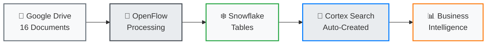

# Demo Guide

The Snowflake OpenFlow Unstructured Data Pipeline Demo showcases how to transform Google Drive business documents into queryable strategic intelligence using Cortex Search.

## Demo Architecture



## Quick Reference

<div class="grid cards" markdown>

- :material-play:{ .lg .middle } **Execution Guide**

    ---

    Complete step-by-step demo walkthrough with timing and talking points

    [:octicons-arrow-right-24: Execution Guide](execution-guide.md)

- :material-chat-question:{ .lg .middle } **Sample Questions**

    ---

    Ready-to-use Cortex Search queries organized by business category

    [:octicons-arrow-right-24: Sample Questions](sample-questions.md)

- :material-chart-bar:{ .lg .middle } **Business Intelligence**

    ---

    Deep dive into business insights and analytics opportunities

    [:octicons-arrow-right-24: Business Intelligence](business-intelligence.md)

</div>

## Demo Flow Overview

### Phase 1: Context Setting (2-3 minutes)

- **Business Problem**: Document chaos in Google Drive
- **Solution Vision**: Unified document intelligence
- **Expected Outcome**: Natural language business insights

### Phase 2: Architecture Walkthrough (3-5 minutes)

- **Source**: 16 multi-format business documents
- **Processing**: OpenFlow Google Drive connector
- **Intelligence**: Cortex Search with Arctic embeddings
- **Output**: Interactive business intelligence

### Phase 3: Live Demonstration (8-12 minutes)

- **Strategic Queries**: Expansion plans, financial analysis
- **Operational Queries**: Technology projects, safety protocols
- **Cross-Category Analysis**: Multi-format business intelligence

### Phase 4: Business Value (3-5 minutes)

- **Quantified Results**: Time savings, accessibility improvements
- **Scalability Vision**: Enterprise document intelligence
- **Implementation Path**: Next steps and recommendations

## Document Collection

### 16 Business Documents Across 4 Categories

=== "📊 Strategic Planning"
    **Executive Intelligence & Decision Making**

    | Document | Format | Business Value |
    |----------|--------|----------------|
    | Market Expansion Strategy | JPG (5 images) | Visual revenue projections, growth charts |
    | Q4 Board Meeting Minutes | DOCX | Executive decisions, strategic governance |
    | Q3 Financial Analysis | PDF | ROI calculations, performance metrics |
    
    **Key Insights**: $2.8M investment decisions, 15% revenue growth targets

=== "⚡ Operations Excellence"
    **Technology & Infrastructure Investment**

    | Document | Format | Business Value |
    |----------|--------|----------------|
    | Sound System Modernization | DOCX | $2.8M project timeline, business case |
    | Venue Setup Operations | JPG (4 images) | Safety protocols, equipment management |
    | Post-Event Analysis | PPTX | Performance review, improvement recommendations |
    
    **Key Insights**: 18-month modernization timeline, operational efficiency gains

=== "🛡️ Compliance & Risk"
    **Regulatory & Risk Management**

    | Document | Format | Business Value |
    |----------|--------|----------------|
    | Health & Safety Policy | PDF | Medical procedures, regulatory compliance |
    | Audio Equipment Service Agreement | PDF | Vendor contracts, liability coverage |
    | Summer 2024 Event Analysis | PPTX | Incident reports, risk mitigation |
    
    **Key Insights**: Complete regulatory compliance documentation

=== "🎓 Knowledge Management"
    **Training & Organizational Learning**

    | Document | Format | Business Value |
    |----------|--------|----------------|
    | Customer Service Training | PPTX | Staff onboarding, service frameworks |
    | Venue Operations Manual | JPG (shared) | Procedural knowledge, visual guides |
    | Board Meeting Context | DOCX (shared) | Strategic decisions, organizational direction |
    
    **Key Insights**: Cross-functional collaboration patterns

## Query Categories & Examples

### Executive Decision Support

```
"What are our 2025 expansion plans and target markets?"
"Show me all financial analysis and revenue projections"  
"Which strategic initiatives require the largest investments?"
```

### Operational Intelligence

```
"Find all technology modernization projects and their budgets"
"Show me venue setup procedures and safety protocols"
"What operational improvements were implemented after Summer 2024?"
```

### Compliance & Risk Analysis

```
"What health and safety policies are currently in effect?"
"Find all vendor contracts and service agreements"
"Show me compliance requirements across all business areas"
```

### Knowledge Discovery

```
"Find all training materials and staff development programs"
"Which documents have the most collaboration and strategic importance?"
"Show me cross-functional knowledge sharing patterns"
```

## Demo Success Metrics

| Capability | Traditional Method | With Document Intelligence | Improvement |
|------------|-------------------|---------------------------|-------------|
| **Document Search** | 30-60 min manual search | 5-second natural query | **90% faster** |
| **Cross-format Analysis** | Manual review required | Instant unified insights | **New capability** |
| **Executive Access** | IT support needed | Self-service queries | **100% autonomy** |
| **Compliance Lookup** | Hours of hunting | Instant policy access | **95% time savings** |

## Audience Customization

### For C-Level Executives

- **Focus**: Strategic intelligence, ROI, competitive advantage
- **Key Queries**: Expansion plans, financial projections, investment decisions
- **Talking Points**: Executive decision acceleration, business agility

### For Operations Teams  

- **Focus**: Process optimization, technology modernization
- **Key Queries**: Project timelines, safety protocols, efficiency improvements
- **Talking Points**: Operational excellence, standardization, risk mitigation

### For IT/Data Teams

- **Focus**: Technical architecture, scalability, integration
- **Key Queries**: Multi-format processing, metadata extraction, search performance
- **Talking Points**: Infrastructure, automation, enterprise capabilities

---

## Ready to Demo

Choose your demo approach:

<div class="grid cards" markdown>

- **Quick Demo (15 min)**

    Focused on high-value strategic and operational queries

    [:material-arrow-right: Quick Demo Flow](execution-guide.md#option-b-focused-business-intelligence-15-minutes)

- **Complete Demo (30 min)**

    Full walkthrough of all four business categories

    [:material-arrow-right: Complete Demo Flow](execution-guide.md#option-a-executive-intelligence-demo-30-minutes)

</div>
