# Sample Questions

Ready-to-use Cortex Search queries organized by business category for effective demos. Each question is designed to showcase specific document intelligence capabilities.

## Query Execution Flow

```mermaid
graph LR
    A[💬 Natural Language Query] --> B[🧠 Cortex Search<br/>Arctic Embeddings]
    B --> C[📄 Document Search<br/>Multi-format Content]
    C --> D[📊 Structured Results<br/>Business Intelligence]
    D --> E[🎯 Demo Insights<br/>Executive Decisions]
    
    classDef queryStyle fill:#f8f9fa,stroke:#6c757d,stroke-width:2px
    classDef searchStyle fill:#e9ecef,stroke:#007bff,stroke-width:2px
    classDef documentStyle fill:#f8f9fa,stroke:#28a745,stroke-width:2px
    classDef resultsStyle fill:#e9ecef,stroke:#fd7e14,stroke-width:2px
    classDef insightsStyle fill:#f8f9fa,stroke:#6f42c1,stroke-width:2px
    
    class A queryStyle
    class B searchStyle
    class C documentStyle
    class D resultsStyle
    class E insightsStyle
```



!!! tip "Demo Flow"
    Start with simple strategic questions, then build complexity to show cross-format and multi-category analysis capabilities.

## 📊 Strategic Planning & Executive Intelligence

### Executive Decision Support

```sql
-- Query: What are our 2025 expansion plans and target markets?
SELECT PARSE_JSON(
  SNOWFLAKE.CORTEX.SEARCH_PREVIEW(
      'festival_service_improved',
      '{
        "query": "2025 expansion plans target markets revenue growth",
        "columns": ["text", "channel", "username"],
        "limit": 5
      }'
  )
)['results'] as expansion_strategy;
```

**Expected Results**: Market expansion visuals, 15% revenue growth targets, 3 new markets

---

```sql
-- Query: Show me all financial analysis and revenue projections
SELECT PARSE_JSON(
  SNOWFLAKE.CORTEX.SEARCH_PREVIEW(
      'festival_service_improved',
      '{
        "query": "financial analysis revenue projections ROI Q3 2024",
        "columns": ["text", "channel", "username"],
        "limit": 5
      }'
  )
)['results'] as financial_intelligence;
```

**Expected Results**: Q3 performance metrics, investment ROI calculations, budget analysis

### Strategic Investment Analysis

```sql
-- Query: Which strategic initiatives require the largest investments?
SELECT PARSE_JSON(
  SNOWFLAKE.CORTEX.SEARCH_PREVIEW(
      'festival_service_improved',
      '{
        "query": "strategic initiatives largest investments budget millions",
        "columns": ["text", "channel", "username"],
        "limit": 5
      }'
  )
)['results'] as investment_priorities;
```

**Expected Results**: $2.8M sound system project, technology modernization, infrastructure investments

## ⚡ Operations Excellence & Technology Modernization

### Technology Investment Intelligence

```sql
-- Query: Find all technology modernization projects and their budgets
SELECT PARSE_JSON(
  SNOWFLAKE.CORTEX.SEARCH_PREVIEW(
      'festival_service_improved',
      '{
        "query": "technology modernization projects budgets sound system upgrade",
        "columns": ["text", "channel", "username"],
        "limit": 5
      }'
  )
)['results'] as technology_projects;
```

**Expected Results**: $2.8M sound system upgrade, 18-month timeline, business case justification

---

```sql
-- Query: Show me venue setup procedures and safety protocols
SELECT PARSE_JSON(
  SNOWFLAKE.CORTEX.SEARCH_PREVIEW(
      'festival_service_improved',
      '{
        "query": "venue setup procedures safety protocols operations manual",
        "columns": ["text", "channel", "username"],
        "limit": 5
      }'
  )
)['results'] as operational_procedures;
```

**Expected Results**: Venue setup manual images, safety procedures, equipment management

### Performance & Efficiency Analysis

```sql
-- Query: What operational improvements were implemented after Summer 2024?
SELECT PARSE_JSON(
  SNOWFLAKE.CORTEX.SEARCH_PREVIEW(
      'festival_service_improved',
      '{
        "query": "operational improvements Summer 2024 post event analysis performance",
        "columns": ["text", "channel", "username"],
        "limit": 5
      }'
  )
)['results'] as operational_improvements;
```

**Expected Results**: Post-event analysis findings, efficiency improvements, incident resolutions

## 🛡️ Compliance & Risk Management

### Policy & Regulatory Intelligence

```sql
-- Query: What health and safety policies are currently in effect?
SELECT PARSE_JSON(
  SNOWFLAKE.CORTEX.SEARCH_PREVIEW(
      'festival_service_improved',
      '{
        "query": "health safety policies medical procedures regulatory compliance",
        "columns": ["text", "channel", "username"],
        "limit": 5
      }'
  )
)['results'] as safety_policies;
```

**Expected Results**: Health & safety policy documentation, medical procedures, regulatory requirements

---

```sql
-- Query: Find all vendor contracts and service agreements
SELECT PARSE_JSON(
  SNOWFLAKE.CORTEX.SEARCH_PREVIEW(
      'festival_service_improved',
      '{
        "query": "vendor contracts service agreements audio equipment liability",
        "columns": ["text", "channel", "username"],
        "limit": 5
      }'
  )
)['results'] as vendor_intelligence;
```

**Expected Results**: Audio service agreements, liability coverage, vendor performance terms

### Risk Assessment Intelligence

```sql
-- Query: Show me compliance requirements across all business areas
SELECT PARSE_JSON(
  SNOWFLAKE.CORTEX.SEARCH_PREVIEW(
      'festival_service_improved',
      '{
        "query": "compliance requirements business areas regulatory audit risk",
        "columns": ["text", "channel", "username"],
        "limit": 5
      }'
  )
)['results'] as compliance_overview;
```

**Expected Results**: Cross-functional compliance documentation, audit requirements, risk assessments

## 🎓 Knowledge Management & Staff Development

### Training & Development Intelligence

```sql
-- Query: Find all training materials and staff development programs
SELECT PARSE_JSON(
  SNOWFLAKE.CORTEX.SEARCH_PREVIEW(
      'festival_service_improved',
      '{
        "query": "training materials staff development customer service excellence",
        "columns": ["text", "channel", "username"],
        "limit": 5
      }'
  )
)['results'] as training_intelligence;
```

**Expected Results**: Customer service training guide, staff onboarding materials, development frameworks

---

```sql
-- Query: Show me cross-functional collaboration patterns
SELECT PARSE_JSON(
  SNOWFLAKE.CORTEX.SEARCH_PREVIEW(
      'festival_service_improved',
      '{
        "query": "cross functional collaboration patterns knowledge sharing teams",
        "columns": ["text", "channel", "username"],
        "limit": 5
      }'
  )
)['results'] as collaboration_insights;
```

**Expected Results**: Document collaboration data, cross-team knowledge sharing, organizational patterns

## 🔍 Advanced Cross-Category Intelligence

### Multi-Format Business Intelligence

```sql
-- Query: Which documents have the most collaboration and strategic importance?
SELECT PARSE_JSON(
  SNOWFLAKE.CORTEX.SEARCH_PREVIEW(
      'festival_service_improved',
      '{
        "query": "collaboration strategic importance documents comments decisions",
        "columns": ["text", "channel", "username"],
        "limit": 10
      }'
  )
)['results'] as strategic_collaboration;
```

**Expected Results**: Operations manual (22 comments), expansion strategy (18 comments), board minutes

---

```sql
-- Query: What operational risks and mitigation strategies are documented?
SELECT PARSE_JSON(
  SNOWFLAKE.CORTEX.SEARCH_PREVIEW(
      'festival_service_improved',
      '{
        "query": "operational risks mitigation strategies incident analysis safety",
        "columns": ["text", "channel", "username"],
        "limit": 8
      }'
  )
)['results'] as risk_intelligence;
```

**Expected Results**: Risk assessments, mitigation plans, incident analysis, preventive measures

### Comprehensive Business Intelligence

```sql
-- Query: Show me comprehensive insights across all 16 documents - what patterns emerge?
SELECT PARSE_JSON(
  SNOWFLAKE.CORTEX.SEARCH_PREVIEW(
      'festival_service_improved',
      '{
        "query": "business patterns insights strategic operational compliance knowledge",
        "columns": ["text", "channel", "username"],
        "limit": 12
      }'
  )
)['results'] as comprehensive_intelligence;
```

**Expected Results**: Cross-category business patterns, strategic alignment, operational excellence themes

## 💡 Progressive Demo Questioning Strategy

### Level 1: Simple Category Questions (5 minutes)

Start with single-category queries to establish baseline functionality:

1. **Strategic**: "What are our 2025 expansion plans?"
2. **Operations**: "Find technology modernization projects"
3. **Compliance**: "What safety policies are in effect?"
4. **Training**: "Show me staff development programs"

### Level 2: Cross-Format Analysis (5 minutes)

Demonstrate multi-format intelligence:

1. **Multi-Format**: "Show me expansion strategy across all document types"
2. **Format-Specific**: "Find visual diagrams and charts about our growth plans"
3. **Collaborative**: "Which documents have the most team collaboration?"

### Level 3: Advanced Business Intelligence (5-10 minutes)

Showcase sophisticated analysis:

1. **Pattern Recognition**: "What business patterns emerge across all categories?"
2. **Risk Analysis**: "Show me operational risks and mitigation strategies"
3. **Investment Intelligence**: "Connect technology investments to business outcomes"
4. **Strategic Alignment**: "How do training programs align with expansion plans?"

## 🎯 Audience-Specific Question Sets

### For C-Level Executives

Focus on strategic intelligence and ROI:

```sql
-- Executive Dashboard Query
SELECT PARSE_JSON(
  SNOWFLAKE.CORTEX.SEARCH_PREVIEW(
      'festival_service_improved',
      '{
        "query": "executive dashboard strategic decisions investment ROI expansion revenue",
        "columns": ["text", "channel", "username"],
        "limit": 8
      }'
  )
)['results'] as executive_intelligence;
```

### For Operations Managers

Emphasize process optimization and efficiency:

```sql
-- Operations Dashboard Query  
SELECT PARSE_JSON(
  SNOWFLAKE.CORTEX.SEARCH_PREVIEW(
      'festival_service_improved',
      '{
        "query": "operations efficiency procedures technology modernization safety protocols",
        "columns": ["text", "channel", "username"],
        "limit": 8
      }'
  )
)['results'] as operations_intelligence;
```

### For Compliance Teams

Highlight regulatory and risk management:

```sql
-- Compliance Dashboard Query
SELECT PARSE_JSON(
  SNOWFLAKE.CORTEX.SEARCH_PREVIEW(
      'festival_service_improved',
      '{
        "query": "compliance policies regulatory requirements risk management audit",
        "columns": ["text", "channel", "username"],
        "limit": 8
      }'
  )
)['results'] as compliance_intelligence;
```

---

## Query Performance Tips

!!! success "Optimizing Demo Queries"
    - **Use Specific Terms**: Include business-specific keywords (e.g., "sound system", "Q3 2024")
    - **Combine Concepts**: Mix format types with business concepts ("visual expansion strategy")  
    - **Limit Results**: Use appropriate limits (3-5 for focused, 8-12 for comprehensive)
    - **Test Beforehand**: Validate queries return expected results before demo

!!! tip "Natural Language Tips"
    - **Business Language**: Use terms executives and managers would naturally ask
    - **Context-Rich**: Include timeframes, amounts, and specific business areas
    - **Progressive**: Start simple, build to complex multi-category queries

---

**Ready to demonstrate the power of document intelligence?** Use these sample questions to showcase how natural language transforms business document chaos into strategic intelligence!
