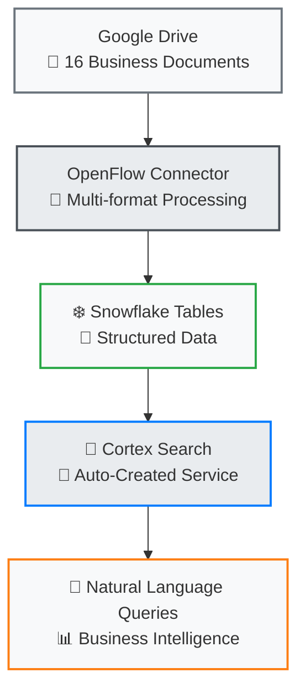

# Getting Started

Welcome to the Snowflake OpenFlow Unstructured Data Pipeline Demo! This comprehensive guide will get you up and running with a complete document intelligence solution in under 30 minutes.

## What You'll Build

By the end of this setup, you'll have a working demo that transforms **16 realistic business documents** from Google Drive into queryable business intelligence using:

- **Google Drive** → Document storage and collaboration
- **OpenFlow** → Document processing and extraction  
- **Cortex Search** → Natural language query capabilities
- **Snowflake Intelligence** → Business insights and analytics

## Demo Overview

### Complete Pipeline Architecture

## Business Document Categories

=== "Strategic Planning"
    **Executive Intelligence & Decision Making**

    - Market expansion strategies (JPG visualizations)
    - Board meeting minutes (DOCX collaboration)
    - Financial analysis & projections (PDF reports)
    
    !!! example "Query Example"
        *"What are our 2025 expansion plans and expected ROI?"*

=== "Operations Excellence"
    **Technology & Infrastructure Investment**

    - $2.8M sound system modernization project
    - Venue setup operational procedures  
    - Post-event performance analysis
    
    !!! example "Query Example"
        *"Show me all technology modernization projects and budgets"*

=== "Compliance & Risk"
    **Regulatory & Risk Management**

    - Health & safety policy documentation
    - Vendor service agreements & contracts
    - Incident analysis & mitigation strategies
    
    !!! example "Query Example"
        *"What safety policies are currently in effect?"*

=== "Knowledge Management"
    **Training & Organizational Learning**

    - Customer service training materials
    - Cross-functional collaboration patterns
    - Organizational knowledge sharing
    
    !!! example "Query Example"
        *"Find all staff development and training programs"*

## Quick Start Options

Choose your preferred setup approach:

- :material-clock-fast:{ .lg .middle } **15-Minute Setup**

    ---

    Perfect for quick demos and proof-of-concepts

    [:octicons-arrow-right-24: Quick Setup](quick-setup.md)

- :material-cog:{ .lg .middle } **Complete Setup**

    ---

    Full production-ready configuration with all features

    [:octicons-arrow-right-24: Prerequisites](prerequisites.md)

## Expected Outcomes

After completing the setup, you'll be able to:

✅ **Query Business Documents**: Ask natural language questions about your organizational content  
✅ **Multi-Format Intelligence**: Search across PDF, DOCX, PPTX, and JPG documents simultaneously  
✅ **Executive Decision Support**: Get instant insights for strategic planning and operational decisions  
✅ **Compliance Monitoring**: Instantly access policy and regulatory documentation  
✅ **Knowledge Discovery**: Find training materials and cross-functional collaboration patterns  

## Success Metrics

| Capability | Traditional Approach | With Document Intelligence | Improvement |
|------------|---------------------|---------------------------|-------------|
| Document Search | 30-60 min manual | 5-sec natural language | **90% faster** |
| Cross-format Analysis | Manual review required | Instant unified insights | **New capability** |
| Executive Access | IT support needed | Self-service queries | **100% autonomy** |
| Compliance Lookup | Hours of document hunting | Instant policy access | **95% time savings** |

---

Ready to get started? Choose your setup approach above!
