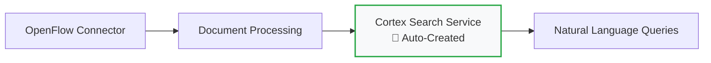

# Quick Setup

Get your Snowflake OpenFlow demo running in 15 minutes with this streamlined setup guide.

!!! success "Perfect for Demos"
    This quick setup focuses on the essential components needed to run the demo effectively, skipping optional configurations.

## Prerequisites Checklist

Before starting, ensure you have:

- [ ] **Snowflake Enterprise Account** with OpenFlow enabled
- [ ] **Google Workspace Admin** access  
- [ ] **Google Cloud Project** with Drive API enabled
- [ ] **Service Account** with domain-wide delegation configured

!!! tip "Need Help?"
    If you haven't completed the prerequisites, see the [detailed prerequisites guide](prerequisites.md).

## Step 1: Repository Setup (2 minutes)

### Clone and Install Dependencies

```bash
# Clone the repository
git clone https://github.com/kameshsampath/openflow-unstructured-data-pipeline-demo.git
cd openflow-unstructured-data-pipeline-demo

# Install Python dependencies  
uv sync

# Verify Taskfile automation
task --list
```

### Verify Document Collection

```bash
# Check that all 16 demo documents are present
ls -la sample-data/google-drive-docs/
```

You should see folders for:

- Analysis/
- Compliance/
- Executive Meetings/
- Financial Reports/
- Operations/
- Projects/
- Strategic Planning/
- Training/
- Vendors/

## Step 2: Google Drive Setup (5 minutes)

### Option A: Use Google Apps Script (Recommended)

1. **Open Google Apps Script**: <https://script.google.com>
2. **Create New Project**: Copy contents from `scripts/google-apps-script/CreateFolderStructure.gs`
3. **Configure Shared Drive ID**: Edit the `createDemoFolders()` function
4. **Run Script**: Creates complete folder structure automatically

### Option B: Manual Setup

```bash
# Create local Google Drive folder structure
task create-google-drive-folder-structure

# Manually create "Festival Operations" shared drive in Google Drive
# Upload documents per the folder structure
```

## Step 3: Document Processing (3 minutes)

### Convert Documents to All Formats

```bash
# Convert all documents to optimized formats (PDF, DOCX, PPTX, JPG)
task convert-all-docs

# Copy documents to Google Drive location (if using local sync)
task copy-all-categories
```

### Verify Document Upload

Check your Google Drive "Festival Operations" shared drive contains:

- **Strategic Planning/** - Market expansion images, board minutes, financial reports
- **Operations/** - Technology projects, venue setup manuals, event analysis  
- **Compliance/** - Health policies, vendor agreements
- **Training/** - Customer service materials

## Step 4: Snowflake Configuration (3 minutes)

### Database Setup

```sql
-- Create target database and schema
CREATE DATABASE IF NOT EXISTS openflow_demo;
CREATE SCHEMA IF NOT EXISTS openflow_demo.festivals;

-- Create service user for OpenFlow
CREATE USER IF NOT EXISTS openflow_service
TYPE = SERVICE
MUST_CHANGE_PASSWORD = FALSE;

-- Grant necessary privileges
GRANT USAGE ON WAREHOUSE compute_wh TO openflow_service;
GRANT ALL ON DATABASE openflow_demo TO openflow_service;
```

### OpenFlow Connector Configuration

1. **Access OpenFlow UI** in your Snowflake account
2. **Create Google Drive Connector**:
   - Name: `festival_operations_connector`
   - Service Account: Upload your JSON key file
   - Shared Drive: Select "Festival Operations"
   - Target: `openflow_demo.festivals`

3. **Start Connector**: Begin document processing

## Step 5: Cortex Search Intelligence (Automatic)

!!! success "Automated Setup"
    **Cortex Search service is created automatically** by the OpenFlow Google Drive (Cortex connect) connector. No manual SQL required!

### How It Works



**Automatic Features:**

- ✅ **Arctic Embeddings**: Automatically configured with `snowflake-arctic-embed-m-v1.5`
- ✅ **Document Indexing**: All processed documents automatically indexed
- ✅ **Semantic Search**: Ready for natural language queries immediately
- ✅ **Metadata Integration**: Document properties, authors, and collaboration data included

### Verify Automatic Setup

```sql
-- Check auto-created service (name will be generated by OpenFlow)
SHOW CORTEX SEARCH SERVICES;

-- Test natural language query
SELECT PARSE_JSON(
  SNOWFLAKE.CORTEX.SEARCH_PREVIEW(
      '<AUTO_GENERATED_SERVICE_NAME>',
      '{"query": "expansion plans", "limit": 3}'
  )
)['results'] as search_results;
```

## Step 6: Demo Validation (1 minute)

### Test Key Business Queries

Run these sample queries to verify everything works:

=== "Strategic Intelligence"
    ```sql
    SELECT PARSE_JSON(
      SNOWFLAKE.CORTEX.SEARCH_PREVIEW(
          'festival_service_improved',
          '{"query": "2025 expansion plans target markets", "limit": 5}'
      )
    )['results'] as strategic_insights;
    ```

=== "Operations Excellence"
    ```sql  
    SELECT PARSE_JSON(
      SNOWFLAKE.CORTEX.SEARCH_PREVIEW(
          'festival_service_improved',
          '{"query": "technology modernization projects budgets", "limit": 5}'
      )
    )['results'] as operations_insights;
    ```

=== "Compliance & Risk"
    ```sql
    SELECT PARSE_JSON(
      SNOWFLAKE.CORTEX.SEARCH_PREVIEW(
          'festival_service_improved',
          '{"query": "health safety policies", "limit": 5}'
      )
    )['results'] as compliance_insights;
    ```

## Quick Demo Commands Reference

### Document Management

```bash
# Convert all document formats
task convert-all-docs

# Deploy to Google Drive  
task copy-all-categories

# Clean up for reset
task clean-converted-docs
```

### Category-Specific Uploads

```bash
# Strategic Planning & Executive docs
task copy-category-1-strategic

# Operations Excellence & Technology docs  
task copy-category-2-operations

# Compliance & Risk Management docs
task copy-category-3-compliance

# Knowledge Management & Training docs
task copy-category-4-knowledge
```

## Expected Demo Results

After setup, you can demonstrate:

✅ **Natural Language Queries**: "What are our 2025 expansion plans?"  
✅ **Multi-Format Search**: Find insights across PDF, DOCX, PPTX, JPG documents  
✅ **Business Intelligence**: Strategic, operational, compliance, and training insights  
✅ **Executive Decision Support**: Instant access to $2.8M investment analysis  
✅ **Cross-Category Analysis**: Unified view across all business functions  

## Troubleshooting

### Common Issues

!!! failure "OpenFlow Connector Not Visible"
    **Solution**: Verify Enterprise account and contact Snowflake support to enable BYOC/SPCS

!!! failure "Google Drive Access Denied"
    **Solution**: Check service account domain-wide delegation and OAuth scopes

!!! failure "Cortex Search Service Creation Failed"  
    **Solution**: Verify Cortex Search is enabled in your account region

!!! failure "Documents Not Processing"
    **Solution**: Check OpenFlow connector logs and verify file permissions

### Quick Fixes

```bash
# Reset document collection
task clean-converted-docs
task convert-all-docs

# Verify Google Drive structure
ls -la ~/Google\ Drive/Shared\ drives/Festival\ Operations/

# Check Snowflake connectivity
snowsql -a your_account -u your_username
```

---

## Next Steps

<div class="grid cards" markdown>

- **Run Demo**
  
  Execute the complete demo with sample business questions
  
  [:material-arrow-right: Demo Execution Guide](../demo-guide/execution-guide.md)

- **Business Intelligence**
  
  Explore advanced analytics and business insights
  
  [:material-arrow-right: Business Analysis](../demo-guide/business-intelligence.md)

</div>

---

**🎉 Congratulations!** Your Snowflake OpenFlow document intelligence demo is ready. You can now transform unstructured business documents into queryable strategic intelligence!
