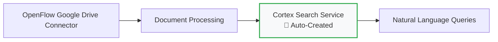

# Quick Setup

Get your Snowflake OpenFlow demo running in 15 minutes with this streamlined setup guide. This quick setup focuses on the essential components needed to run the demo effectively, skipping optional configurations.

!!! warning "Demo Data Disclaimer"
    All business data, financial figures, and organizational information in this demo are fictitious and for demonstration purposes only.

## Prerequisites Checklist

Before starting, ensure you have:

- [ ] **Snowflake Enterprise Account** with OpenFlow enabled
- [ ] **Google Workspace Admin** access  
- [ ] **Google Cloud Project** with Drive API enabled
- [ ] **Service Account** with domain-wide delegation configured

!!! tip "Need Help?"
    If you haven't completed the prerequisites, see the [detailed prerequisites guide](prerequisites.md).

!!! warning "Required Tools Check"
    **Before proceeding**, ensure you have these tools installed:
    ```bash
    git --version    # Git (for cloning repository)
    task --version   # Task (for automation commands)  
    uv --version     # uv (for Python dependencies)
    python3 --version  # Python 3.12+ (for processing)
    snowsql --version  # SnowSQL (for database queries)
    ```
    **Missing tools?** See [installation instructions](prerequisites.md#required-development-tools)

## Step 1: Repository Setup (2 minutes)

### Clone and Install Dependencies

```bash
# Clone the repository
git clone https://github.com/kameshsampath/openflow-unstructured-data-pipeline-demo.git
cd openflow-unstructured-data-pipeline-demo

# Verify Taskfile automation is working
task --list

# Optional: Install Python dependencies (only needed for document conversion)
uv sync
```

### Verify Document Collection

```bash
# Check that all demo documents are present
ls -la sample-data/google-drive-docs/
```

You should see the following file structure with **16 business documents** across multiple formats:

```
sample-data/google-drive-docs/
├── Analysis/
│   └── Post-Event-Analysis-Summer-2024.pptx
├── Compliance/
│   └── Health-Safety-Policy.pdf
├── Executive Meetings/
│   └── Board-Meeting-Minutes-Q4-2024.docx
├── Financial Reports/
│   └── Q3-2024-Financial-Analysis.pdf
├── Operations/
│   ├── Venue-Setup-Operations-Manual-0.jpg
│   ├── Venue-Setup-Operations-Manual-1.jpg
│   ├── Venue-Setup-Operations-Manual-2.jpg
│   └── Venue-Setup-Operations-Manual-3.jpg
├── Projects/
│   └── Sound-System-Modernization-Project-Charter.docx
├── Strategic Planning/
│   ├── 2025-Festival-Expansion-Strategy-0.jpg
│   ├── 2025-Festival-Expansion-Strategy-1.jpg
│   ├── 2025-Festival-Expansion-Strategy-2.jpg
│   ├── 2025-Festival-Expansion-Strategy-3.jpg
│   └── 2025-Festival-Expansion-Strategy-4.jpg
├── Training/
│   └── Customer-Service-Training-Guide.pptx
└── Vendors/
    └── Audio-Equipment-Service-Agreement.pdf
```

**Document Formats**: PDF, DOCX, PPTX, JPG - demonstrating **true multi-format document intelligence**

!!! note "Source Files"
    The `.md` files are conversion templates and not uploaded to Google Drive. The demo uses the converted formats shown above.

## Step 2: Google Drive Setup (5 minutes)

### Option A: Use Google Apps Script (Recommended)

1. **Open Google Apps Script**: <https://script.google.com>
2. **Create New Project**: Copy contents from `scripts/google-apps-script/CreateFolderStructure.gs`
3. **Configure Shared Drive ID**: Edit the `createDemoFolders()` function
4. **Run Script**: Creates complete folder structure and uploads demo documents automatically

### Option B: Manual Web Upload

1. **Create Shared Drive**: In Google Drive web, create "Festival Operations" shared drive
2. **Create Folder Structure**: Manually create these demo category folders:
   - Strategic Planning/
   - Operations/  
   - Compliance/
   - Training/
3. **Upload Documents**: Drag and drop files from `sample-data/google-drive-docs/` into corresponding folders based on the demo categories you plan to demonstrate.

## Step 3: Document Processing (3 minutes)

### Convert Documents to All Formats

```bash
# Optional: Convert all documents (only if you modified sample-data markdowns)
task convert-all-docs

# Copy documents to Google Drive location (only if you have local Google Drive sync)
task copy-all-categories
```

### Verify Document Upload

Check your Google Drive "Festival Operations" shared drive contains:

- **Strategic Planning/** - Market expansion images, board minutes, financial reports
- **Operations/** - Technology projects, venue setup manuals, event analysis  
- **Compliance/** - Health policies, vendor agreements
- **Training/** - Customer service materials

## Step 4: Snowflake Configuration (3 minutes)

### Database Setup

```sql
-- Create target database and schema
CREATE DATABASE IF NOT EXISTS openflow_festival_demo;
CREATE SCHEMA IF NOT EXISTS openflow_festival_demo.festivals_ops;

-- Create service user for OpenFlow
CREATE USER IF NOT EXISTS festival_demo_service
TYPE = SERVICE
MUST_CHANGE_PASSWORD = FALSE;

-- Grant necessary privileges
GRANT USAGE ON WAREHOUSE compute_wh TO festival_demo_service;
GRANT ALL ON DATABASE openflow_festival_demo TO festival_demo_service;
```

### OpenFlow Connector Configuration

1. **Access OpenFlow UI** in your Snowflake account
2. **Create Google Drive Connector**:
   - Name: `festival_operations_connector`
   - Service Account: Upload your JSON key file
   - Shared Drive: Select "Festival Operations"
   - Target: `openflow_festival_demo.festivals_ops`

3. **Start Connector**: Begin document processing

## Step 5: Cortex Search Intelligence (Automatic)

**Cortex Search service is created automatically** by the OpenFlow Google Drive (Cortex connect) connector. No manual SQL required!

### How It Works



**Automatic Features:**

- ✅ **Arctic Embeddings**: Automatically configured with `snowflake-arctic-embed-m-v1.5`
- ✅ **Document Indexing**: All processed documents automatically indexed
- ✅ **Semantic Search**: Ready for natural language queries immediately
- ✅ **Metadata Integration**: Document properties, authors, and collaboration data included

### Verify Automatic Setup

```sql
-- Verify the auto-created service
SHOW CORTEX SEARCH SERVICES;

-- Test natural language query
SELECT PARSE_JSON(
  SNOWFLAKE.CORTEX.SEARCH_PREVIEW(
      'FESTIVALS_OPS_SEARCH_SERVICE',
      '{"query": "expansion plans", "limit": 3}'
  )
)['results'] as search_results;
```

!!! info "Service Name"
    The service will be auto-created as `FESTIVALS_OPS_SEARCH_SERVICE` by OpenFlow after the first document is processed.

## Step 6: Demo Validation (1 minute)

### Test Key Business Queries

Run these sample queries to verify everything works:

=== "Strategic Intelligence"
    ```sql
    SELECT PARSE_JSON(
      SNOWFLAKE.CORTEX.SEARCH_PREVIEW(
          'FESTIVALS_OPS_SEARCH_SERVICE',
          '{"query": "2025 expansion plans target markets", "limit": 5}'
      )
    )['results'] as strategic_insights;
    ```

=== "Operations Excellence"
    ```sql  
    SELECT PARSE_JSON(
      SNOWFLAKE.CORTEX.SEARCH_PREVIEW(
          'FESTIVALS_OPS_SEARCH_SERVICE',
          '{"query": "technology modernization projects budgets", "limit": 5}'
      )
    )['results'] as operations_insights;
    ```

=== "Compliance & Risk"
    ```sql
    SELECT PARSE_JSON(
      SNOWFLAKE.CORTEX.SEARCH_PREVIEW(
          'FESTIVALS_OPS_SEARCH_SERVICE',
          '{"query": "health safety policies", "limit": 5}'
      )
    )['results'] as compliance_insights;
    ```

!!! success "Ready to Use"
    The service name `FESTIVALS_OPS_SEARCH_SERVICE` will be automatically created by OpenFlow

## Demo Resources

Your setup is complete! Access these resources for successful demos:

<div class="grid cards" markdown>

- :material-console:{ .lg .middle } **Demo Commands Reference**

    ---

    Complete Taskfile automation commands, SQL queries, and troubleshooting for ongoing demo usage

    [:octicons-arrow-right-24: Commands Guide](../reference/commands.md){target="_blank"}

- :material-chat-question:{ .lg .middle } **Sample Questions Reference**

    ---

    Categorized business questions organized by function for smooth demo presentations

    [:octicons-arrow-right-24: Demo Questions](../reference/sample-questions.md){target="_blank"}

</div>

## Expected Demo Results

After setup, you can demonstrate:

✅ **Natural Language Queries**: "What are our 2025 expansion plans?"  
✅ **Multi-Format Search**: Find insights across PDF, DOCX, PPTX, JPG documents  
✅ **Business Intelligence**: Strategic, operational, compliance, and training insights  
✅ **Executive Decision Support**: Instant access to investment analysis (demo figures)  
✅ **Cross-Category Analysis**: Unified view across all business functions  

## Troubleshooting

### Common Issues

!!! failure "OpenFlow Connector Not Visible"
    **Solution**: Verify Enterprise account and contact Snowflake support to enable BYOC/SPCS

!!! failure "Google Drive Access Denied"
    **Solution**: Check service account domain-wide delegation and OAuth scopes

!!! failure "Cortex Search Service Creation Failed"  
    **Solution**: Verify Cortex Search is enabled in your account region

!!! failure "Documents Not Processing"
    **Solution**: Check OpenFlow connector logs and verify file permissions

---

## Next Steps

<div class="grid cards" markdown>

- :material-play-circle:{ .lg .middle } **Run Demo**

    ---

    Execute the complete demo with sample business questions and interactive queries

    [:octicons-arrow-right-24: Demo Execution Guide](../demo-guide/execution-guide.md)

- :material-chart-line:{ .lg .middle } **Business Intelligence**

    ---

    Explore advanced analytics and strategic insights from document processing

    [:octicons-arrow-right-24: Business Analysis](../demo-guide/business-intelligence.md)

</div>

---

**🎉 Congratulations!** Your Snowflake OpenFlow document intelligence demo is ready. You can now transform
unstructured business documents into queryable strategic intelligence!
