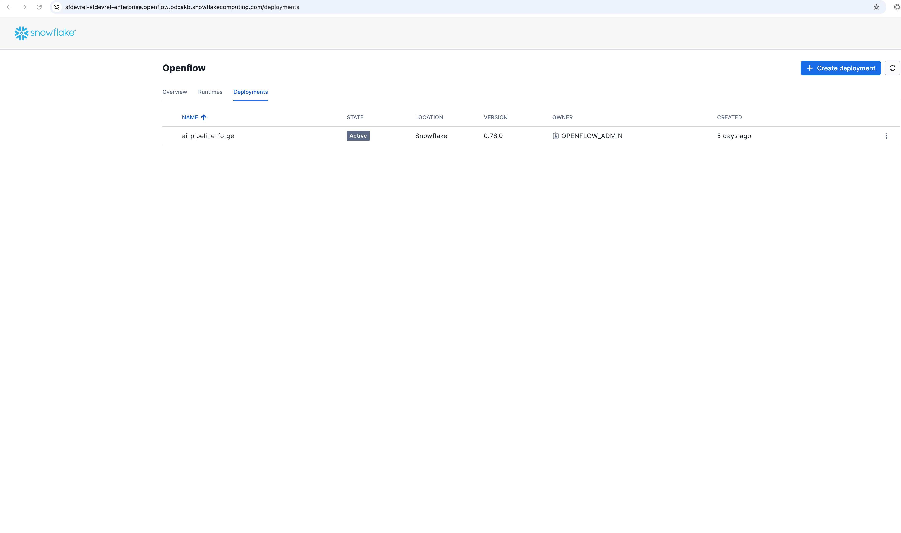
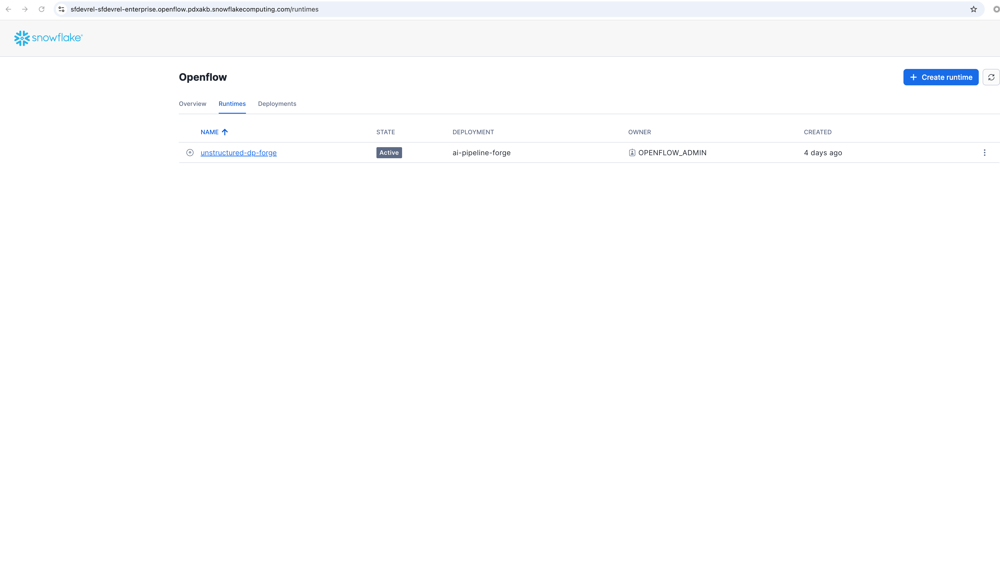

<!--
Copyright 2025 Snowflake Inc.
SPDX-License-Identifier: Apache-2.0

Licensed under the Apache License, Version 2.0 (the "License");
you may not use this file except in compliance with the License.
You may obtain a copy of the License at

http://www.apache.org/licenses/LICENSE-2.0

Unless required by applicable law or agreed to in writing, software
distributed under the License is distributed on an "AS IS" BASIS,
WITHOUT WARRANTIES OR CONDITIONS OF ANY KIND, either express or implied.
See the License for the specific language governing permissions and
limitations under the License.
-->

# Openflow SPCS Setup

Complete guide for setting up Snowflake Openflow using Snowpark Container Services (SPCS).

!!! info "Prerequisites"
    This setup must be completed **before** configuring any Openflow connectors. This is typically a
    one-time setup per Snowflake environment performed by administrators.

## Overview

Setting up Openflow - Snowflake Deployment involves four main tasks as outlined in the [official Snowflake documentation](https://docs.snowflake.com/en/user-guide/data-integration/openflow/setup-openflow-spcs):

| Step | Task | Persona | Duration |
|------|------|---------|----------|
| 1 | Setup Core Snowflake | Snowflake Administrator | 10 min |
| 2 | Create Deployment | Deployment Engineer / Administrator | 5 min |
| 3 | Create Runtime Role | Data Engineer | 5 min |
| 4 | Create Runtime | Data Engineer | 5 min |

!!! note "Availability"
    Snowflake Openflow - Snowflake Deployments are available to all accounts in **AWS and Azure Commercial
    Regions**. This is a Preview Feature gradually rolling out to all accounts.

!!! info "Available Connectors"
    Openflow supports 19+ connectors including Google Drive, Box, SharePoint, Kafka, MySQL, PostgreSQL, and more.
    For a complete list with descriptions, see
    [Openflow connectors](https://docs.snowflake.com/en/user-guide/data-integration/openflow/connectors/about-openflow-connectors).

!!! tip "Additional Resources"
    Check out the [companion GitHub repository](https://github.com/Snowflake-Labs/sfguide-getting-started-with-openflow-spcs)
    which includes Jupyter notebooks demonstrating advanced Openflow configurations and use cases.

## Step 1: Setup Core Snowflake

Before creating a deployment, configure core Snowflake components including the Openflow admin role, required
privileges, and network configuration.

### Create Openflow Admin Role

The `OPENFLOW_ADMIN` role is the primary administrative role for managing Openflow deployments:

```sql
-- Create the Openflow admin role (requires ACCOUNTADMIN or equivalent privileges)
USE ROLE ACCOUNTADMIN;
CREATE ROLE IF NOT EXISTS OPENFLOW_ADMIN;

-- Grant necessary privileges
GRANT CREATE DATABASE ON ACCOUNT TO ROLE OPENFLOW_ADMIN;
GRANT CREATE COMPUTE POOL ON ACCOUNT TO ROLE OPENFLOW_ADMIN;
GRANT CREATE INTEGRATION ON ACCOUNT TO ROLE OPENFLOW_ADMIN;
GRANT BIND SERVICE ENDPOINT ON ACCOUNT TO ROLE OPENFLOW_ADMIN;

-- Grant role to current user and ACCOUNTADMIN
GRANT ROLE OPENFLOW_ADMIN TO ROLE ACCOUNTADMIN;
GRANT ROLE OPENFLOW_ADMIN TO USER IDENTIFIER(CURRENT_USER());
```

### Create Snowflake Deployments Network Rule

Create the required network rule for Openflow deployments to communicate with Snowflake services:

```sql
-- Switch to OPENFLOW_ADMIN role
USE ROLE OPENFLOW_ADMIN;

-- Create network rule for Snowflake Openflow deployments
CREATE OR REPLACE NETWORK RULE snowflake_deployment_network_rule
  MODE = EGRESS
  TYPE = IPV4
  VALUE_LIST = ('10.16.0.0/12');

-- Verify the network rule
DESC NETWORK RULE snowflake_deployment_network_rule;
```

!!! info "Network Rule Configuration"
    This network rule is required for Openflow deployments to communicate with Snowflake's backend services.
    The IP range `10.16.0.0/12` provides access to Snowflake's Openflow infrastructure.

!!! info "Reference Documentation"
    For detailed information, see
    [Setup core Snowflake](https://docs.snowflake.com/en/user-guide/data-integration/openflow/setup-openflow-spcs-sf)
    in the official documentation.

## Step 2: Create Deployment

After configuring core Snowflake, create an Openflow deployment. This is the container environment where Openflow will run.

### Access Openflow in Snowsight

1. **Navigate to Openflow**: Go to **Work with data** → **Ingestion** → **Openflow**
2. **Openflow Interface**: You'll see three tabs:
   - **Overview** - List of available connectors and documentation
   - **Runtimes** - Manage your runtime environments
   - **Deployments** - Create and manage Openflow deployments

### Create Deployment

1. **Navigate to Deployments Tab**: Click on the **Deployments** tab
2. **Create Deployment**: Click **Create Deployment** button
3. **Configure Deployment**:
   - **Deployment Name**: `FESTIVAL_OPS_DEPLOYMENT`
   - **Database**: Select or create a database for Openflow metadata
   - **Compute Pool**: Select an existing compute pool or create new
   - **Enable Event Table**: (Optional) Enable for logging and monitoring

### Optional: Configure Event Table

For advanced monitoring and troubleshooting:

```sql
-- Create event table for Openflow logs
USE ROLE OPENFLOW_ADMIN;
CREATE EVENT TABLE IF NOT EXISTS OPENFLOW_CONFIG.EVENTS.openflow_events;

-- Grant privileges
GRANT INSERT ON EVENT TABLE OPENFLOW_CONFIG.EVENTS.openflow_events TO ROLE OPENFLOW_ADMIN;
```

### Verify Deployment Status

Check that your deployment is running via the Snowsight UI:

1. **Navigate to Deployments Tab**: Go to **Work with data** → **Ingestion** → **Openflow** → **Deployments**
2. **Check Status**: Look for `FESTIVAL_OPS_DEPLOYMENT` with status **ACTIVE**



Expected status: **ACTIVE**

!!! info "Reference Documentation"
    For detailed information, see
    [Create deployment](https://docs.snowflake.com/en/user-guide/data-integration/openflow/setup-openflow-spcs-deployment)
    in the official documentation.

## Step 3: Create Runtime Role

After creating the deployment, create a runtime role with associated external access integrations. This role
defines what external services your connectors can access.

### Create Runtime Role

```sql
-- Create runtime role (requires ACCOUNTADMIN privileges)
USE ROLE ACCOUNTADMIN;
CREATE ROLE IF NOT EXISTS FESTIVAL_DEMO_ROLE;

-- Grant necessary privileges for database and schema
GRANT USAGE ON DATABASE OPENFLOW_FESTIVAL_DEMO TO ROLE FESTIVAL_DEMO_ROLE;
GRANT ALL PRIVILEGES ON SCHEMA OPENFLOW_FESTIVAL_DEMO.FESTIVAL_OPS TO ROLE FESTIVAL_DEMO_ROLE;
GRANT USAGE ON WAREHOUSE FESTIVAL_DEMO_S TO ROLE FESTIVAL_DEMO_ROLE;

-- Grant runtime role to Openflow admin
GRANT ROLE FESTIVAL_DEMO_ROLE TO ROLE OPENFLOW_ADMIN;
```

### Configure Google Drive External Access Integration

!!! info "Connector-Specific Configuration"
    The External Access Integration for Google Drive will be created in the next chapter modules when setting up
    the [Openflow Connector for Google Drive](https://docs.snowflake.com/user-guide/data-integration/openflow/connectors/google-drive/about).
    This integration configures the network rules required for the runtime to access Google Drive APIs.

**What you'll configure in the next steps:**

- **Network Rules** - Google API endpoints (admin.googleapis.com, oauth2.googleapis.com, etc.)
- **Optional Workspace Domain** - Your specific Google Workspace domain (e.g., your-company.com)
- **External Access Integration** - Combines network rules and grants to Openflow runtime

!!! tip "Preview the Configuration"
    All SQL snippets for Google Drive network configuration are available in `sql/network.sql` in the repository.
    You'll execute these as part of the connector setup in the following chapters.

!!! info "Reference Documentation"
    For detailed information, see
    [Create runtime role](https://docs.snowflake.com/en/user-guide/data-integration/openflow/setup-openflow-spcs-create-rr)
    in the official documentation.

## Step 4: Create Runtime

Create a runtime associated with the previously created runtime role. A runtime is the execution environment
for your Openflow connectors.

### Create Runtime via Snowsight

1. **Navigate to Runtimes**: Go to **Work with data** → **Ingestion** → **Openflow** → **Runtimes** tab
2. **Create Runtime**: Click **Create Runtime**
3. **Configure Runtime**:
   - **Runtime Name**: e.g., `FESTIVAL_DOC_INTELLIGENCE`
   - **Runtime Role**: Select `FESTIVAL_DEMO_ROLE`
   - **External Access Integration**: Select `festival_ops_access_integration`
   - **Compute Pool**: Select an existing compute pool

### Verify Runtime Status

Check that your runtime is active via the Snowsight UI:

1. **Navigate to Runtimes Tab**: Go to **Work with data** → **Ingestion** → **Openflow** → **Runtimes**
2. **Check Status**: Look for `FESTIVAL_DOC_INTELLIGENCE` with status **ACTIVE**



Expected status: **ACTIVE**

!!! success "Runtime Configuration"
    Database and schema configuration will be specified at the connector level when setting up individual
    connectors (e.g., Google Drive connector).

!!! info "Reference Documentation"
    For detailed information, see
    [Create runtime](https://docs.snowflake.com/en/user-guide/data-integration/openflow/setup-openflow-spcs-create-runtime)
    in the official documentation.

## Next: Configure Google Drive Connector

With your Openflow SPCS infrastructure set up, you're ready to configure connectors to ingest data from external sources.

### Continue with Quick Setup

For the Festival Operations demo, proceed to configure the Google Drive connector:

<div class="grid cards" markdown>

- :material-lightning-bolt:{ .lg .middle } **Quick Setup Guide**

    ---

    Complete end-to-end setup including Google Drive connector configuration, document upload, and Snowflake Intelligence

    [:octicons-arrow-right-24: Quick Setup](quick-setup.md)

- :material-connection:{ .lg .middle } **Detailed Connector Guide**

    ---

    Step-by-step visual guide with screenshots for configuring the Google Drive connector

    [:octicons-arrow-right-24: Connector Setup](setup-openflow.md)

</div>

!!! info "Available Connectors"
    Openflow supports 19+ connectors including Google Drive, Box, SharePoint, Kafka, MySQL, PostgreSQL, and more.
    For a complete list, see
    [Openflow connectors](https://docs.snowflake.com/en/user-guide/data-integration/openflow/connectors/about-openflow-connectors).

## Troubleshooting

### Deployment Not Starting

**Issue**: Deployment status stuck in `CREATING` or `ERROR`

**Solutions**:

- Verify compute pool is available and has sufficient resources
- Check `OPENFLOW_ADMIN` role has all required privileges
- Review event table logs for error details

### Runtime Cannot Access External Services

**Issue**: Connector fails to connect to external services (e.g., Google Drive)

**Solutions**:

- Verify external access integration includes correct network rules
- Check runtime role has USAGE privilege on external access integration
- Ensure network rules include all required hostnames (Google APIs, workspace domain)

### Permission Errors

**Issue**: "Insufficient privileges" errors when creating resources

**Solutions**:

- Verify you're using `OPENFLOW_ADMIN` or `ACCOUNTADMIN` role
- Check all grants were applied correctly in Step 1
- Ensure runtime role has necessary database/schema privileges

## Summary

After completing this setup, you will have:

- ✅ **`OPENFLOW_ADMIN` role** - Administrative role with deployment and integration privileges
- ✅ **Snowflake Deployments Network Rule** - Required for Openflow to communicate with Snowflake services
- ✅ **Openflow Deployment (`FESTIVAL_OPS_DEPLOYMENT`)** - Container environment running in SPCS
- ✅ **Runtime Role (`FESTIVAL_DEMO_ROLE`)** - With database and warehouse access
- ✅ **Active Runtime (`FESTIVAL_DOC_INTELLIGENCE`)** - Ready to host connectors

**You're now ready to configure the Google Drive connector and its External Access Integration!**

## Next Steps

Choose your path to complete the setup:

<div class="grid cards" markdown>

- :material-lightning-bolt:{ .lg .middle } **Recommended: Quick Setup**

    ---

    Complete end-to-end demo setup in 15 minutes

    [:octicons-arrow-right-24: Quick Setup Guide](quick-setup.md)

- :material-connection:{ .lg .middle } **Detailed Setup**

    ---

    Step-by-step visual guide for connector configuration

    [:octicons-arrow-right-24: Connector Setup](setup-openflow.md)

</div>

## Reference Documentation

### Official Snowflake Documentation

- [Openflow SPCS Setup Overview](https://docs.snowflake.com/en/user-guide/data-integration/openflow/setup-openflow-spcs)
- [Setup Core Snowflake](https://docs.snowflake.com/en/user-guide/data-integration/openflow/setup-openflow-spcs-sf)
- [Create Deployment](https://docs.snowflake.com/en/user-guide/data-integration/openflow/setup-openflow-spcs-deployment)
- [Create Runtime Role](https://docs.snowflake.com/en/user-guide/data-integration/openflow/setup-openflow-spcs-create-rr)
- [Create Runtime](https://docs.snowflake.com/en/user-guide/data-integration/openflow/setup-openflow-spcs-create-runtime)
- [Openflow Connectors](https://docs.snowflake.com/en/user-guide/data-integration/openflow/connectors/about-openflow-connectors)

### Related Resources

- [Snowpark Container Services (SPCS)](https://docs.snowflake.com/en/developer-guide/snowpark-container-services/overview)
- [External Access Integration](https://docs.snowflake.com/en/developer-guide/external-network-access/creating-using-external-network-access)
- [Manage Openflow](https://docs.snowflake.com/en/user-guide/data-integration/openflow/manage-openflow)
- [Monitor Openflow](https://docs.snowflake.com/en/user-guide/data-integration/openflow/monitor-openflow)
