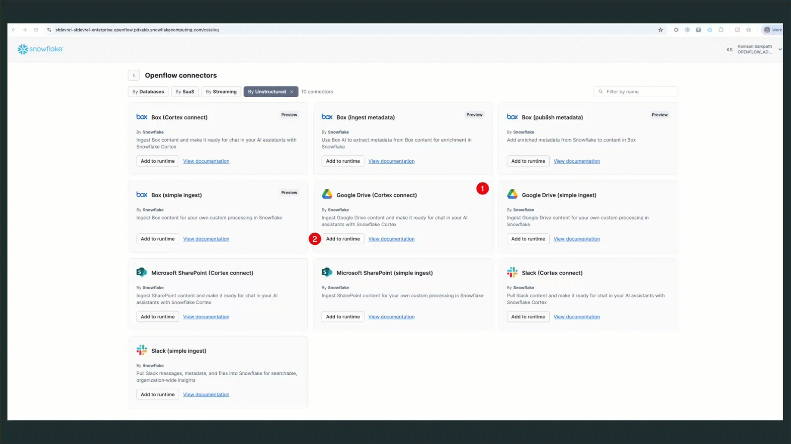

<!--
Copyright 2025 Snowflake Inc.
SPDX-License-Identifier: Apache-2.0

Licensed under the Apache License, Version 2.0 (the "License");
you may not use this file except in compliance with the License.
You may obtain a copy of the License at

http://www.apache.org/licenses/LICENSE-2.0

Unless required by applicable law or agreed to in writing, software
distributed under the License is distributed on an "AS IS" BASIS,
WITHOUT WARRANTIES OR CONDITIONS OF ANY KIND, either express or implied.
See the License for the specific language governing permissions and
limitations under the License.
-->

# Setup Openflow Connector

Step-by-step visual guide for configuring the Snowflake Openflow Google Drive connector with screenshots.

!!! info "Deployment Options"
    This demo uses **Snowflake Openflow on SPCS** (Snowpark Container Services) for simplicity. The same setup can be configured using **Snowflake Openflow BYOC** (Bring Your Own Cloud) with identical functionality.

## Prerequisites: Openflow SPCS Deployment

Before configuring connectors, ensure you have a complete **Openflow SPCS deployment and runtime** ready:


**Required Setup (completed by Snowflake Administrator):**

Following the [official Snowflake Openflow SPCS setup guide](https://docs.snowflake.com/en/user-guide/data-integration/openflow/setup-openflow-spcs), ensure you have:

1. **✅ Core Snowflake Configuration** - Admin role, privileges, network configuration
2. **✅ Openflow Deployment Created** - SPCS deployment with optional event table configuration  
3. **✅ Runtime Role Created** - With external access integrations
4. **✅ Runtime Created** - Associated with the runtime role
5. **✅ Deployment Status: Running** - Ready to accept connector configurations

!!! warning "Administrator Setup Required"
    The Openflow SPCS deployment and runtime setup requires **Snowflake Administrator** privileges and must be completed before proceeding with connector configuration. This is typically a one-time setup per environment.

---

!!! important "Demo Configuration Values"
    **Screenshots in Steps 2-4 show example values**. Replace them with your **Festival Demo settings**:

    - **Database**: `OPENFLOW_FESTIVAL_DEMO`
    - **Schema**: `festivals_ops`  
    - **Service User**: `festival_demo_service`
    - **Google Drive Shared Drive**: `Festival Operations`
    - **Cortex Search Service**: `FESTIVALS_OPS_SEARCH_SERVICE` (auto-created)

## Step 1: Add Openflow Connector to Runtime

Navigate to **Openflow** in your Snowflake account and access the connectors list:


**Available Connectors**: Choose "Google Drive" for unstructured document processing and click "Add"



## Step 2: Configure Google Drive Source

Set up the Google Drive source parameters for your Festival Operations shared drive:


**Key Configuration Parameters:**

- **GCP Service Account JSON**: Upload your Google Service Account JSON key file
- **Google Delegation User**: `hi@kameshs.dev` (your Google Workspace user with drive access)

!!! tip "Google Service Account (GSA) Setup"
    - Create and download your GSA JSON key file from Google Cloud Console
    - Enable domain-wide delegation for the service account
    - Ensure appropriate permissions to access your target Google Drive folder

!!! warning "Credential Management"
    **For sensitive values like GSA JSON**: Consider using credential management tools like:

    - **HashiCorp Vault** for enterprise environments
    - **AWS Secrets Manager** if using AWS infrastructure  
    - **Azure Key Vault** for Azure-based deployments
    - **Google Secret Manager** for Google Cloud environments

## Step 3: Set Destination Parameters

Configure the Snowflake destination for processed documents:


**Destination Configuration Parameters:**

- **Destination Database**: `OPENFLOW_FESTIVAL_DEMO`
- **Destination Schema**: `FESTIVAL_OPS`
- **Snowflake Role**: `FESTIVAL_DEMO_ROLE`
- **Snowflake Warehouse**: `FESTIVAL_DEMO_S`
- **Snowflake Authentication Strategy**: `SNOWFLAKE_SESSION_TOKEN`

!!! info "SPCS Authentication"
    With **Openflow SPCS deployment**, authentication uses `SNOWFLAKE_SESSION_TOKEN` automatically. The connector inherits your current Snowflake session - no passwords or additional account credentials required.

!!! warning "Credential Security"
    **For production environments**: Use credential management solutions to securely store and rotate your GSA JSON keys:

    - **Enterprise**: HashiCorp Vault, CyberArk, AWS Secrets Manager
    - **Cloud-native**: Google Secret Manager, Azure Key Vault
    - **Best practices**: Regular key rotation, least-privilege access

## Step 4: Configure Ingestion Parameters

Define how documents will be processed and ingested (inherits destination settings):


**Ingestion Configuration Parameters:**

**Database & Schema:**

- **Destination Database**: `OPENFLOW_FESTIVAL_DEMO`
- **Destination Schema**: `FESTIVAL_OPS`
- **Snowflake File Hash Table Name**: `FILE_HASHES`

**Google Drive Settings:**

- **Google Folder Name**: `Festival Operations`
- **Google Domain**: `kameshs.dev`
- **Google Drive ID**: `[Your shared drive ID]`
- **Google Delegation User**: `hi@kameshs.dev`

**File Processing:**

- **File Extensions To Ingest**: `pdf,txt,docx,xlsx,pptx,html,jpg`
- **OCR Mode**: `LAYOUT` (preserves document structure during text extraction)

**Snowflake Connection:**

- **Snowflake Role**: `FESTIVAL_DEMO_ROLE`
- **Snowflake Warehouse**: `FESTIVAL_DEMO_S`
- **Snowflake Cortex Search Service Role**: `FESTIVAL_DEMO_ROLE`
- **Snowflake Authentication Strategy**: `SNOWFLAKE_SESSION_TOKEN`

**Authentication:**

- **GCP Service Account JSON**: Your GSA JSON key file (securely stored)

!!! info "Session-Based Authentication"
    With `SNOWFLAKE_SESSION_TOKEN` authentication, the connector automatically inherits your current Snowflake session credentials. No additional username, password, or private key configuration required.

## Step 5: Start the Connector

Once all parameters are configured, deploy and start the connector:


**Deployment Steps:**

1. **Review Configuration**: Verify all settings are correct
2. **Enable Controller Services**: Right-click canvas and enable all Controller services
3. **Start Connector**: Begin document processing  
4. **Monitor Progress**: Watch as documents are ingested and processed

!!! success "Automatic Cortex Search Creation"
    The connector will automatically create the `FESTIVAL_OPS_SEARCH_SERVICE` after processing the first document. No additional configuration required!

## Expected Results

After connector setup and initial processing:

✅ **Snowflake Objects Created**

```
Database: OPENFLOW_FESTIVAL_DEMO
Schema: FESTIVAL_OPS  
Tables: [Auto-created by OpenFlow based on document structure]
Cortex Search Service: FESTIVAL_OPS_SEARCH_SERVICE
```

✅ **Document Processing Status**

- **Multi-format Support**: PDF, DOCX, PPTX, JPG files processed
- **Content Extraction**: Full document text and metadata available
- **Search Indexing**: Documents indexed for natural language queries

✅ **Demo Readiness Indicators**

- Natural language queries return results
- Multi-format document search active across all business categories
- Cortex Search service responding with business intelligence

---

## Next Steps

<div class="grid cards" markdown>

- :material-play-circle:{ .lg .middle } **Test Your Setup**

    ---

    Validate the connector with sample queries from the Quick Setup guide

    [:octicons-arrow-right-24: Demo Validation](quick-setup.md#step-6-demo-validation-1-minute)

- :material-chat-question:{ .lg .middle } **Start Demos**

    ---

    Access ready-to-use sample questions for business presentations

    [:octicons-arrow-right-24: Sample Questions](../reference/sample-questions.md){target="_blank"}

- :material-robot:{ .lg .middle } **Snowflake Intelligence**

    ---

    Create an AI agent for conversational document queries

    [:octicons-arrow-right-24: Setup AI Agent](../setup/snowflake-intelligence.md)

</div>
