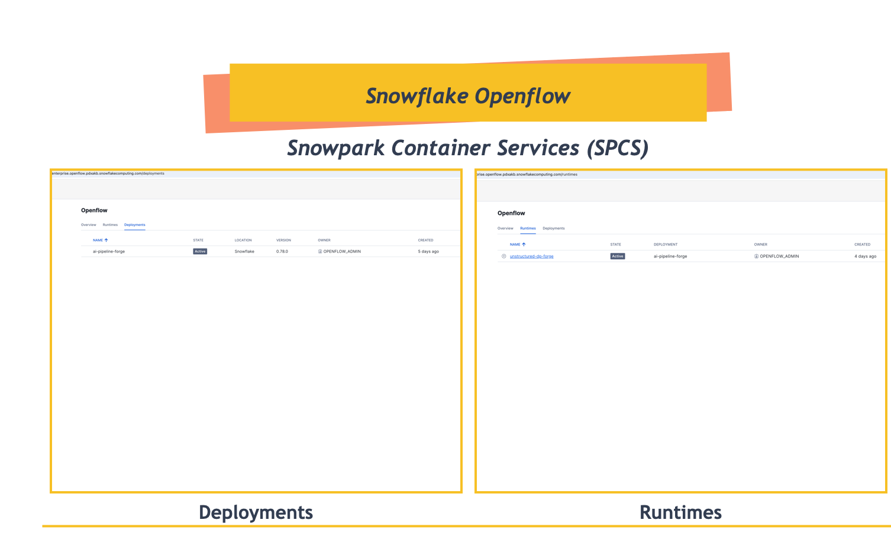
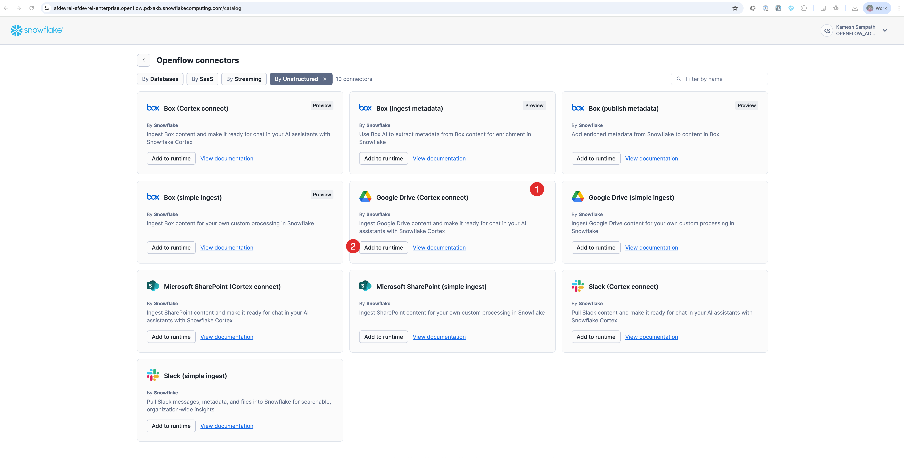
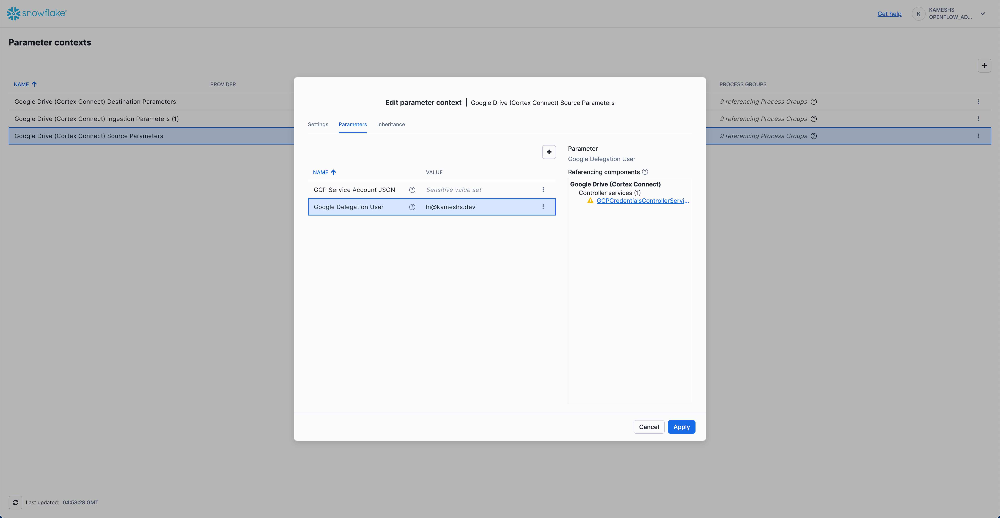
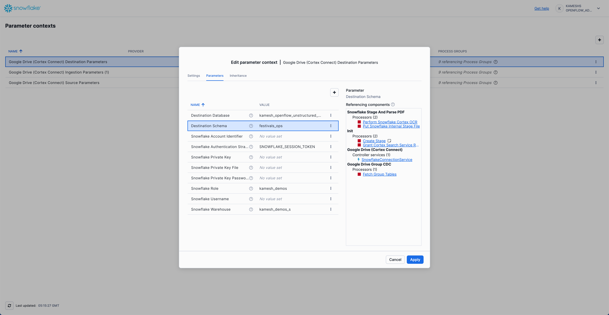
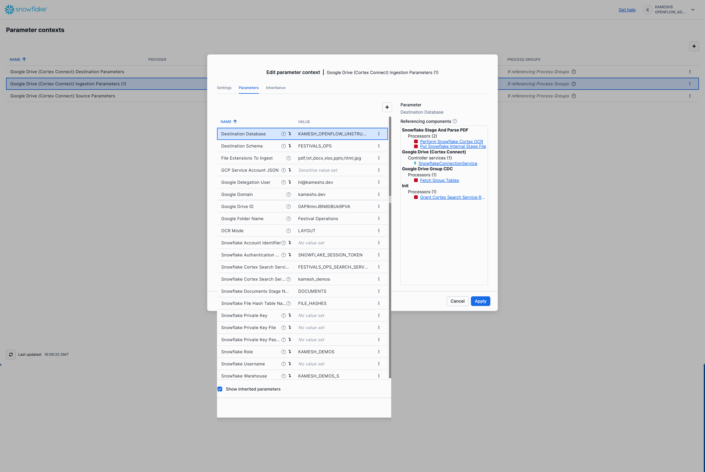
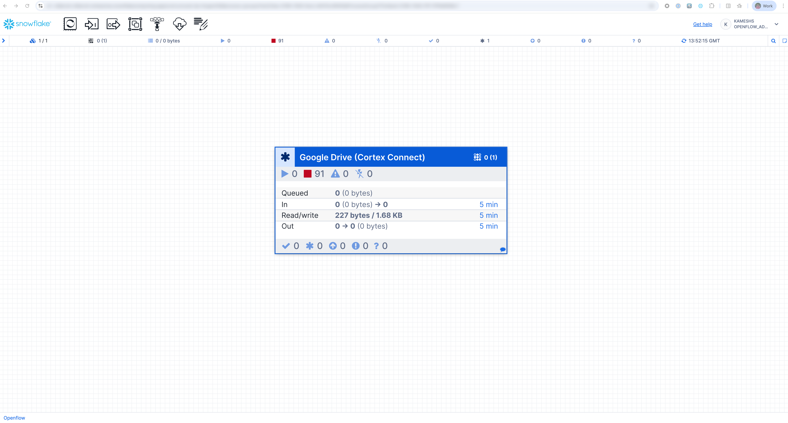

# Setup OpenFlow Connector

Step-by-step visual guide for configuring the Snowflake OpenFlow Google Drive connector with screenshots.

!!! info "Deployment Options"
    This demo uses **Snowflake OpenFlow on SPCS** (Snowpark Container Services) for simplicity. The same setup can be configured using **Snowflake OpenFlow BYOC** (Bring Your Own Cloud) with identical functionality.

## Prerequisites: OpenFlow SPCS Deployment

Before configuring connectors, ensure you have a complete **OpenFlow SPCS deployment and runtime** ready:



**Required Setup (completed by Snowflake Administrator):**

Following the [official Snowflake OpenFlow SPCS setup guide](https://docs.snowflake.com/en/user-guide/data-integration/openflow/setup-openflow-spcs), ensure you have:

1. **✅ Core Snowflake Configuration** - Admin role, privileges, network configuration
2. **✅ OpenFlow Deployment Created** - SPCS deployment with optional event table configuration  
3. **✅ Runtime Role Created** - With external access integrations
4. **✅ Runtime Created** - Associated with the runtime role
5. **✅ Deployment Status: Running** - Ready to accept connector configurations

!!! warning "Administrator Setup Required"
    The OpenFlow SPCS deployment and runtime setup requires **Snowflake Administrator** privileges and must be completed before proceeding with connector configuration. This is typically a one-time setup per environment.

---

!!! important "Demo Configuration Values"
    **Screenshots in Steps 2-4 show example values**. Replace them with your **Festival Demo settings**:

    - **Database**: `openflow_festival_demo`
    - **Schema**: `festivals_ops`  
    - **Service User**: `festival_demo_service`
    - **Google Drive Shared Drive**: `Festival Operations`
    - **Cortex Search Service**: `FESTIVALS_OPS_SEARCH_SERVICE` (auto-created)

## Step 1: Access OpenFlow Connectors

Navigate to **OpenFlow** in your Snowflake account and access the connectors list:



**Available Connectors**: Choose "Google Drive" for unstructured document processing

## Step 2: Configure Google Drive Source

Set up the Google Drive source parameters for your Festival Operations shared drive:



**Key Configuration:**

- **Shared Drive**: Select "Festival Operations"
- **Service Account**: Upload your JSON key file
- **Folder Structure**: Include all document categories

## Step 3: Set Destination Parameters

Configure the Snowflake destination for processed documents:



**Destination Configuration:**

- **Database**: `openflow_festival_demo`
- **Schema**: `festivals_ops`
- **Service User**: `festival_demo_service`
- **Cortex Search**: Auto-create `FESTIVALS_OPS_SEARCH_SERVICE`

!!! info "SPCS Authentication"
    With **OpenFlow SPCS deployment**, authentication uses `SNOWFLAKE_SESSION_TOKEN` automatically. No passwords or additional account credentials required - the connector inherits your current Snowflake session.

## Step 4: Configure Ingestion Parameters

Define how documents will be processed and ingested (inherits destination settings):



**Processing Settings:**

- **Multi-format Support**: PDF, DOCX, PPTX, JPG
- **Content Extraction**: Full document text and metadata
- **Cortex Search Integration**: Automatic service creation
- **Destination Inheritance**: Uses database/schema from Step 3

## Step 5: Start the Connector

Once all parameters are configured, deploy and start the connector:



**Deployment Steps:**

1. **Review Configuration**: Verify all settings are correct
2. **Enable Controller Services**: Right-click canvas and enable all Controller services
3. **Start Connector**: Begin document processing  
4. **Monitor Progress**: Watch as documents are ingested and processed

!!! success "Automatic Cortex Search Creation"
    The connector will automatically create the `FESTIVALS_OPS_SEARCH_SERVICE` after processing the first document. No additional configuration required!

## Expected Results

After connector setup and initial processing:

✅ **Snowflake Objects Created**

```
Database: openflow_festival_demo
Schema: festivals_ops  
Tables: [Auto-created by OpenFlow based on document structure]
Cortex Search Service: FESTIVALS_OPS_SEARCH_SERVICE
```

✅ **Document Processing Status**

- **Multi-format Support**: PDF, DOCX, PPTX, JPG files processed
- **Content Extraction**: Full document text and metadata available
- **Search Indexing**: Documents indexed for natural language queries

✅ **Demo Readiness Indicators**

- Natural language queries return results
- Multi-format document search active across all business categories
- Cortex Search service responding with business intelligence

---

## Next Steps

<div class="grid cards" markdown>

- :material-play-circle:{ .lg .middle } **Test Your Setup**

    ---

    Validate the connector with sample queries from the Quick Setup guide

    [:octicons-arrow-right-24: Demo Validation](quick-setup.md#step-6-demo-validation-1-minute)

- :material-chat-question:{ .lg .middle } **Start Demos**

    ---

    Access ready-to-use sample questions for business presentations

    [:octicons-arrow-right-24: Sample Questions](../reference/sample-questions.md){target="_blank"}

</div>
