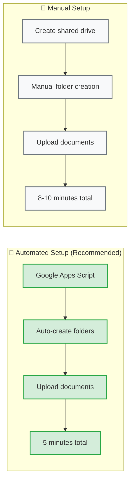

# Setup Workflow

Visual guide showing the complete setup process for the Snowflake OpenFlow demo.

## Complete Setup Flow

```mermaid
graph TD
    A[🚀 Start Setup] --> B[📋 Prerequisites Check]
    B --> C{✅ Requirements Met?}
    C -->|No| D[📖 Review Prerequisites Guide]
    C -->|Yes| E[📁 Repository Setup]
    
    E --> F[🔄 Install Dependencies<br/>uv sync]
    F --> G[📊 Google Drive Setup]
    
    G --> H{📝 Setup Method?}
    H -->|Automated| I[🤖 Google Apps Script<br/>Auto-create folders]
    H -->|Manual| J[👤 Manual Drive Setup<br/>Create folders manually]
    
    I --> K[📄 Document Processing<br/>task convert-all-docs]
    J --> K
    
    K --> L[📤 Upload to Drive<br/>task copy-all-categories]
    L --> M[❄️ Snowflake Configuration]
    
    M --> N[🔗 OpenFlow Connector<br/>Google Drive (Cortex connect)]
    N --> O[🧠 Auto Cortex Search<br/>Service Created]
    
    O --> P[✅ Demo Ready!<br/>Natural Language Queries]
    
    %% Styling
    classDef startStyle fill:#e8f5e8,stroke:#28a745,stroke-width:2px
    classDef processStyle fill:#f8f9fa,stroke:#6c757d,stroke-width:2px
    classDef decisionStyle fill:#fff3cd,stroke:#ffc107,stroke-width:2px
    classDef autoStyle fill:#cce5ff,stroke:#007bff,stroke-width:2px
    classDef endStyle fill:#d4edda,stroke:#28a745,stroke-width:2px
    
    class A,P startStyle
    class B,E,F,G,I,J,K,L,M,N endStyle
    class C,H decisionStyle
    class O autoStyle
```

## Time Breakdown

```mermaid
gantt
    title Setup Timeline (Total: ~15 minutes)
    dateFormat X
    axisFormat %M min
    
    section Prerequisites
    Check requirements     :0, 2
    
    section Repository
    Clone & install        :2, 4
    
    section Google Drive
    Setup method choice    :4, 5
    Folder creation       :5, 8
    Document conversion   :8, 11
    
    section Snowflake
    Database setup        :11, 13
    OpenFlow connector    :13, 15
    
    section Validation
    Test queries          :15, 16
```



## Setup Methods Comparison



## Key Success Indicators

After completing setup, you should see:

✅ **Google Drive Structure**

```
Festival Operations/
├── Strategic Planning/ (3 files)
├── Executive Meetings/ (1 file)
├── Financial Reports/ (1 file)
├── Projects/ (1 file)
├── Operations/ (4 files)
├── Compliance/ (2 files)
├── Training/ (1 file)
└── Analysis/ (1 file)
```

✅ **Snowflake Objects**

```
Database: openflow_demo
Schema: festivals  
Tables: [Auto-created by OpenFlow]
Cortex Search Service: [Auto-generated name]
```

✅ **Demo Readiness**

- Natural language queries work
- Multi-format document search active
- Business intelligence accessible

---

Ready to start? Follow the [Quick Setup Guide](quick-setup.md) for step-by-step instructions!
