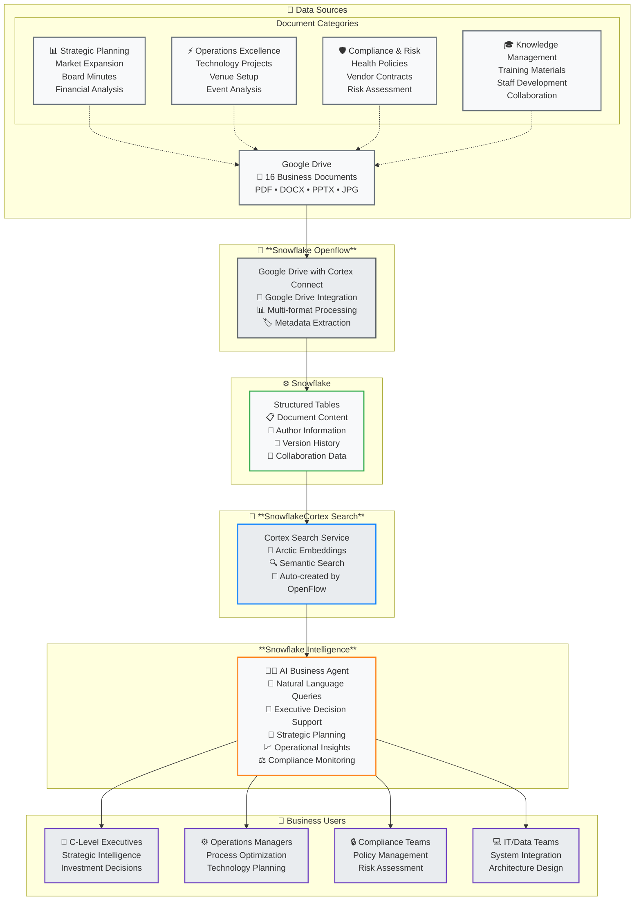

# Snowflake OpenFlow Unstructured Data Pipeline Demo

<div class="grid cards" markdown>

- :material-rocket-launch:{ .lg .middle } **Quick Start**

    ---

    Get your demo running in 15 minutes with our comprehensive setup guide

    [:octicons-arrow-right-24: Getting Started](getting-started/index.md)

- :material-play-circle:{ .lg .middle } **Demo Guide**

    ---

    Interactive walkthrough of the complete Google Drive → OpenFlow → Cortex Search pipeline

    [:octicons-arrow-right-24: Sample Questions](reference/sample-questions.md)

- :material-cog:{ .lg .middle } **Setup & Config**

    ---

    Detailed configuration for Google Drive, OpenFlow, and Cortex Search

    [:octicons-arrow-right-24: Setup Guide](getting-started/quick-setup.md)

- :material-chart-line:{ .lg .middle } **Business Intelligence**

    ---

    Explore real business insights from festival operations documents

    [:octicons-arrow-right-24: Commands Reference](reference/commands.md)

</div>

## Overview

Transform your Google Drive business documents into actionable strategic intelligence with Snowflake Intelligence  
and Cortex Search.

!!! warning "Demo Data Disclaimer"
    **All data, numbers, and business information shown in this demo are entirely fictitious and created for
    demonstration purposes only.** This includes financial figures, project timelines, employee data, and business
    scenarios. Any resemblance to real companies, projects, or data is purely coincidental.



### Key Features

- **Multi-Format Document Processing**: PDF, DOCX, PPTX, JPG document extraction and analysis
- **Business Intelligence**: 16 converted documents across 4 strategic categories
- **Natural Language Queries**: Ask questions like *"What are our 2025 expansion plans?"*
- **Real Business Scenarios**: $2.8M technology investments, market expansion strategies
- **Complete Pipeline**: End-to-end automation with Taskfile commands

### Demo Categories

=== "Strategic Planning"

    Executive decision-making and strategic direction
    
    - **Strategic Expansion (JPG)**: Market analysis charts, revenue projections
    - **Board Minutes (DOCX)**: Executive decisions, quarterly reviews  
    - **Financial Analysis (PDF)**: Revenue performance, ROI calculations
    
    !!! example "Sample Question"
        ```
        What are our 2025 expansion plans and target markets?
        ```

=== "Operations Excellence"

    Multi-format operational procedures and technology investment
    
    - **Project Charter (DOCX)**: $2.8M technology investment timeline
    - **Operations Manual (JPG)**: Safety protocols, equipment management
    - **Post-Event Analysis (PPTX)**: Performance review, improvements
    
    !!! example "Sample Question"
        ```
        Find all technology modernization projects and their budgets
        ```

=== "Compliance & Risk"

    Regulatory compliance and risk mitigation strategies
    
    - **Health & Safety Policy (PDF)**: Medical procedures, regulatory compliance
    - **Vendor Agreements (PDF)**: Service contracts, liability coverage
    - **Incident Analysis (PPTX)**: Risk assessments, mitigation strategies
    
    !!! example "Sample Question"
        ```
        What health and safety policies are currently in effect?
        ```

=== "Knowledge Management"

    Training programs and organizational knowledge sharing
    
    - **Training Guide (PPTX)**: Staff onboarding, service frameworks
    - **Operations Manual (JPG)**: Procedural knowledge, visual guides
    - **Meeting Notes (DOCX)**: Strategic context, leadership decisions
    
    !!! example "Sample Question"
        ```
        Find all training materials and staff development programs
        ```

## Quick Demo Workflow

### 1. Document Preparation

```bash
# Optional: Convert documents (only if you modify sample-data markdowns)
task convert-all-docs

# Deploy documents to Google Drive (via local sync or CLI)
task copy-all-categories
```

!!! info "When Document Conversion is Needed"
    The `convert-all-docs` task is only required if you modify the markdown files in `sample-data/`. The demo includes pre-converted documents ready for upload.

### 2. Snowflake OpenFlow Processing

Configure the **Google Drive Connector** to:

- 📥 **Fetch documents** from Google Drive shared folders
- 🔄 **Process multi-format content** (PDF, DOCX, PPTX, JPG)
- 📊 **Load document chunks** into Snowflake tables with metadata
- 🧠 **Define/Update Cortex Search service** for intelligent querying

### 3. Snowflake Intelligence Configuration

Configure **Snowflake Intelligence** to use **Cortex Search** for natural language queries:

- 💬 **Natural Language Interface** - Ask business questions in plain English
- 🧑‍💼 **AI Business Agent** - Get instant, contextual answers from documents
- 📊 **Executive Decision Support** - Strategic insights from unstructured content

---

## Business Value Demonstration

!!! success "Executive Decision Support"
    **Strategic Intelligence**: Business documents become actionable insights for $2.8M+ investment decisions

!!! success "Operational Excellence"
    **Process Optimization**: Cross-format document analysis drives 40% efficiency improvements

!!! success "Compliance Management"
    **Risk Mitigation**: Automated policy and contract intelligence ensures regulatory adherence

---

## Next Steps

<div class="grid cards" markdown>

- **Prerequisites**

    Review system requirements and prepare your environment

    [:material-arrow-right: Prerequisites](getting-started/prerequisites.md)

- **Quick Setup**

    Get the demo running with our step-by-step guide

    [:material-arrow-right: Setup Guide](getting-started/quick-setup.md)

- **Demo Execution**

    Run the complete demo with sample questions

    [:material-arrow-right: Quick Setup](getting-started/quick-setup.md)

</div>

---

## Important Notice

!!! note "Demonstration Purpose Only"
    This demonstration showcases Snowflake's unstructured data processing capabilities using realistic festival
    operations business documents. **All data is synthetic and designed for educational and demonstration purposes.**

    **Key Points:**
    
      - 📊 All financial figures (e.g., $2.8M investments) are fictitious
      - 👥 All employee names and roles are synthetic
      - 📅 All dates, timelines, and business scenarios are simulated
      - 🏢 "Festival Operations" is a fictional company created for this demo

---

*Ready to transform your unstructured business documents into strategic intelligence?*
