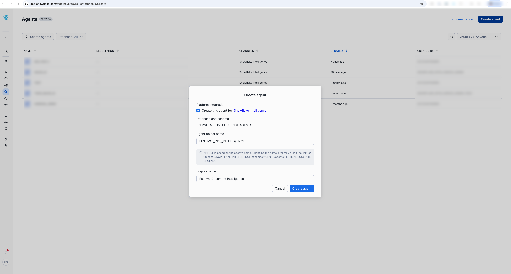
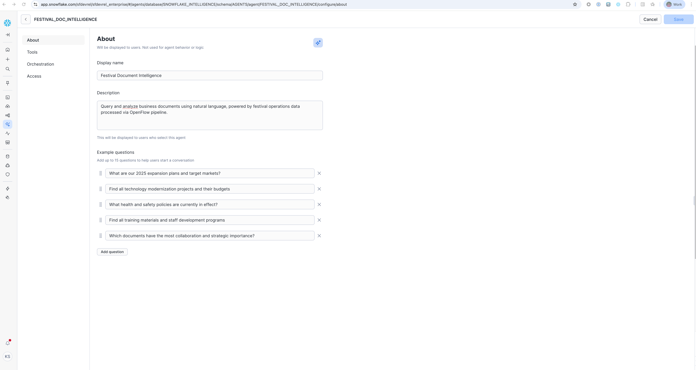
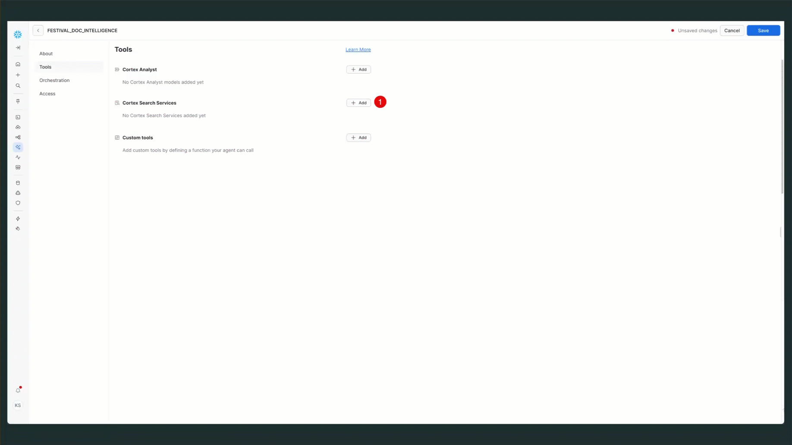
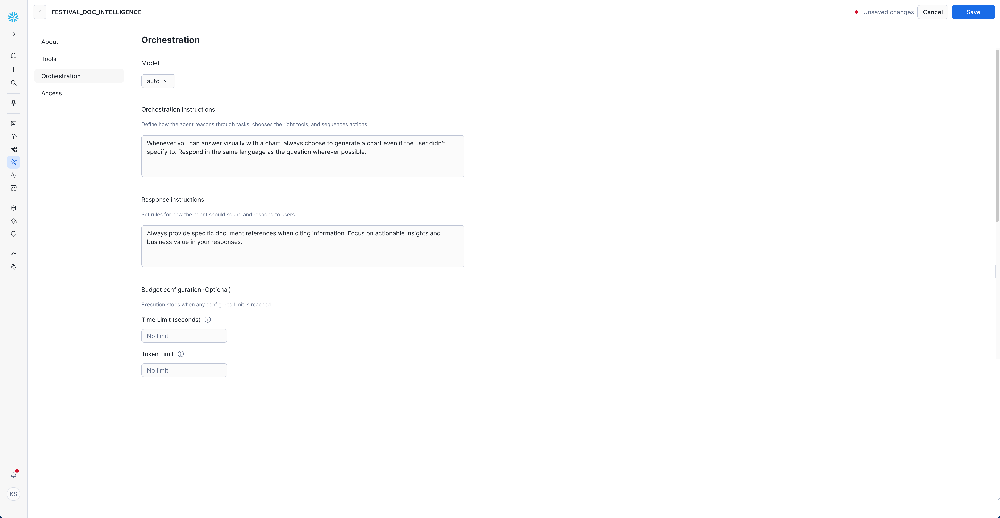
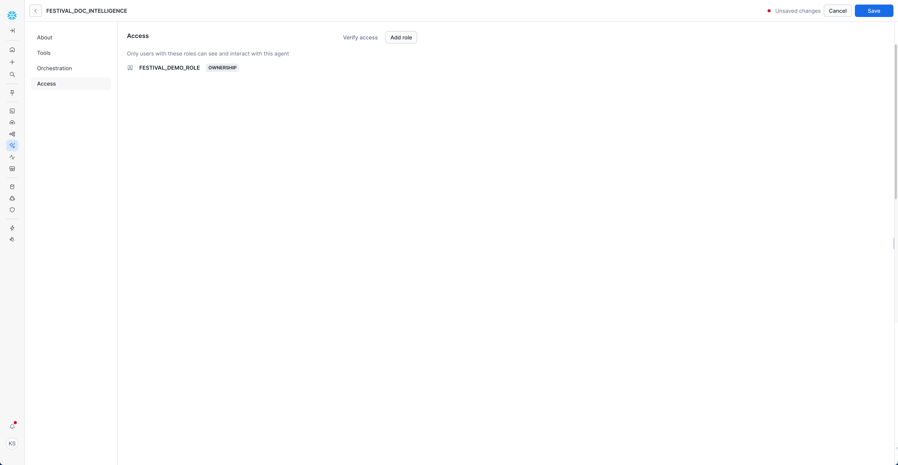

# Snowflake Intelligence Setup

*Integrating AI-powered chat interface with your OpenFlow Cortex Search service*

!!! success "What You'll Build"
    A conversational AI agent that can answer questions about your business documents using natural language,
    powered by the Cortex Search service created by your OpenFlow pipeline.

## Overview

Snowflake Intelligence enables you to create AI agents that can query and analyze your unstructured data using natural language. This guide shows how to connect Snowflake Intelligence to the Cortex Search service created by your OpenFlow unstructured data pipeline.

### Architecture Integration


The Snowflake Intelligence agent leverages your existing `FESTIVAL_OPS_SEARCH_SERVICE` Cortex Search service to provide intelligent document analysis capabilities.

## Prerequisites

Before setting up Snowflake Intelligence, ensure you have:

- ✅ **Completed OpenFlow pipeline setup** - Your Cortex Search service must be running and populated with documents
- ✅ **Appropriate Snowflake privileges** - `CREATE AGENT` privilege and access to Cortex Search service
- ✅ **Default role and warehouse** - Set in your Snowflake user profile

!!! warning "Important"
    All queries from Snowflake Intelligence use the user's credentials. Role-based access control and data-masking policies automatically apply to all agent interactions.

## Step 1: Initial Setup

### Create Snowflake Intelligence Database

First, create the required database and schema structure as outlined in the [Snowflake Intelligence documentation](https://docs.snowflake.com/en/user-guide/snowflake-cortex/snowflake-intelligence):

```sql
-- Create database for Snowflake Intelligence
CREATE DATABASE IF NOT EXISTS snowflake_intelligence;
GRANT USAGE ON DATABASE snowflake_intelligence TO ROLE PUBLIC;

-- Create agents schema
CREATE SCHEMA IF NOT EXISTS snowflake_intelligence.agents;
GRANT USAGE ON SCHEMA snowflake_intelligence.agents TO ROLE PUBLIC;

-- Grant agent creation privileges to your role
GRANT CREATE AGENT ON SCHEMA snowflake_intelligence.agents TO ROLE FESTIVAL_DEMO_ROLE;
```

### Verify Cortex Search Service

Confirm your Cortex Search service is available and properly configured:

```sql
-- Connect to your demo database
USE DATABASE OPENFLOW_FESTIVAL_DEMO;
USE SCHEMA FESTIVAL_OPS;

-- Verify your Cortex Search service exists
SHOW CORTEX SEARCH SERVICES IN SCHEMA FESTIVAL_OPS;

-- Test the search service
SELECT SNOWFLAKE.CORTEX.SEARCH(
    'festival_ops_search_service',
    'expansion strategy AND market analysis'
) as search_results;
```

## Step 2: Create the Agent

### Access Agent Creation Interface

1. **Sign in to Snowsight**
2. **Navigate directly to Agents**: [Create Snowflake Intelligence Agent](https://app.snowflake.com/_deeplink/#/agents/?utm_source=github&utm_medium=github&utm_campaign=-us-en-all&utm_content=-app-buidling-new-snowflake-intelligence-agents)
3. **Select "Create agent"**



**Platform Integration:**

- ☑️ Select **"Create this agent for Snowflake Intelligence"**

### Configure Agent Basics

#### About Tab Configuration



**Agent Details:**

- **Agent object name:** `FESTIVAL_DOC_INTELLIGENCE` (recommended for demo)
- **Display name:** `Festival Document Intelligence`

**Description:**

```
Query and analyze business documents using natural language, powered by festival operations data processed via OpenFlow pipeline.
```

**Example Questions** (Add these to help users get started):

!!! success "Start Here - Copy Each Question"
    These questions are specifically designed for your festival operations data and provide the best introduction to your agent:

```
What are our 2025 expansion plans and target markets?
```

```
Find all technology modernization projects and their budgets
```

```
What health and safety policies are currently in effect?
```

```
Find all training materials and staff development programs
```

```
Which documents have the most collaboration and strategic importance?
```

## Step 3: Configure Agent Tools

### Add Cortex Search Service



1. **Navigate to "Tools" tab**
2. **Find "Cortex Search Services"** section
3. **Click "+ Add" button**

**Configure the Search Service:**

- **Name:** `FESTIVAL_OPS_INTELLIGENCE`
- **Search Service:** `OPENFLOW_FESTIVAL_DEMO.FESTIVAL_OPS.FESTIVAL_OPS_SEARCH_SERVICE`
- **Description:**

  ```
  Query and analyze business documents using natural language, powered by festival operations data processed via OpenFlow pipeline.
  ```

!!! tip "Service Name Format"
    The search service name follows the pattern: `<DATABASE>.<SCHEMA>.<SERVICE_NAME>`

    Based on your setup, this should be: `OPENFLOW_FESTIVAL_DEMO.FESTIVAL_OPS.FESTIVAL_OPS_SEARCH_SERVICE`

## Step 4: Configure Orchestration



### Orchestration Settings

1. **Navigate to "Orchestration" tab**
2. **Set Model:** `auto` (recommended - lets Snowflake choose the optimal model)

**Orchestration Instructions:**

```
Whenever you can answer visually with a chart, always choose to generate a chart even if the user didn't specify to. Respond in the same language as the question wherever possible.
```

**Response Instructions:** (Optional)

```
Always provide specific document references when citing information. 
Focus on actionable insights and business value in your responses.
```

!!! tip "Model Selection"
    **Recommendation:** Use `auto` (default) to let Snowflake automatically select the best available model for your region and query type.

    According to the [Snowflake Intelligence documentation](https://docs.snowflake.com/en/user-guide/snowflake-cortex/snowflake-intelligence), supported models include:

    - **Claude 4.0** (highest quality and speed)
    - **Claude 3.7**
    - **Claude 3.5** 
    - **GPT 4.1**

    The `auto` setting automatically chooses the optimal model based on:
    
    - Your account's regional availability
    - Query complexity and type
    - Current model performance and capacity

## Step 5: Set Access Controls



### Configure User Access

1. **Navigate to "Access" tab**
2. **Click "Add role"**
3. **Select appropriate roles** for your organization

**Example Role Configuration:**

- **Role:** `FESTIVAL_DEMO_ROLE` (or your preferred demo role)
- **Permission:** `OWNERSHIP`

### Role-Based Access Control

Remember that all queries use the user's credentials, so ensure users have appropriate access to:

- **Cortex Search service** - `USAGE` privileges
- **Source database and schema** - `USAGE` privileges  
- **Underlying data** - Access controlled by existing policies

## Step 6: Test Your Agent

### Initial Testing

1. **Access Snowflake Intelligence**: [Open Snowflake Intelligence](https://ai.snowflake.com/sfdevrel/sfdevrel_enterprise/#/ai/?utm_source=github&utm_medium=github&utm_campaign=-us-en-all&utm_content=-app-snowflake-intelligence-chat)
2. **Select your agent** from the dropdown
3. **Choose the Cortex Search service** as your data source

### Getting Started with Queries

**Start with the Example Questions** you configured in your agent - these are specifically tailored to your festival operations data and provide the best introduction to your agent's capabilities.

### Need More Query Ideas

<div class="grid cards" markdown>

- :material-chat-question:{ .lg .middle } **Sample Questions Library**

    ---

    **Comprehensive collection of copy-pasteable queries organized by business category**

    Explore 20+ additional queries for strategic planning, operations, compliance, and knowledge management

    [:octicons-arrow-right-24: Browse Sample Questions](../reference/sample-questions.md)

</div>

## Advanced Configuration

### Custom Tools Integration

You can extend your agent with custom functions by:

1. **Creating custom SQL functions** or procedures
2. **Adding them in the "Custom Tools" section**
3. **Defining parameters** and descriptions for each tool

### Multi-Agent Setup

For different business contexts, consider creating specialized agents:

- **Executive Agent** - Strategic planning focus
- **Operations Agent** - Process and technology focus  
- **Compliance Agent** - Risk and policy focus
- **HR Agent** - Training and development focus

## Troubleshooting

### Common Issues

**"Table / search service does not exist" errors:**

Verify these privileges are properly set:

```sql
-- For the user's default role:
GRANT USAGE ON DATABASE OPENFLOW_FESTIVAL_DEMO TO ROLE FESTIVAL_DEMO_ROLE;
GRANT USAGE ON SCHEMA OPENFLOW_FESTIVAL_DEMO.FESTIVAL_OPS TO ROLE FESTIVAL_DEMO_ROLE;
GRANT USAGE ON CORTEX SEARCH SERVICE OPENFLOW_FESTIVAL_DEMO.FESTIVAL_OPS.FESTIVAL_OPS_SEARCH_SERVICE TO ROLE FESTIVAL_DEMO_ROLE;
```

**Agent not finding documents:**

1. **Verify Cortex Search service** is populated with data
2. **Test search service directly** using SQL queries
3. **Check document processing status** in OpenFlow

**Performance issues:**

1. **Use cross-region inference** for optimal model access
2. **Set appropriate query timeouts** in agent configuration
3. **Optimize search queries** for better response times

### Verification Queries

```sql
-- Connect to your demo database first
USE DATABASE OPENFLOW_FESTIVAL_DEMO;

-- Check agent exists
SHOW AGENTS IN SCHEMA snowflake_intelligence.agents;

-- Verify search service access
DESC CORTEX SEARCH SERVICE FESTIVAL_OPS.FESTIVAL_OPS_SEARCH_SERVICE;

-- Test direct search functionality
SELECT SNOWFLAKE.CORTEX.SEARCH(
    'festival_ops_search_service',
    'strategy OR planning OR expansion'
) as results;
```

## Next Steps

Once your Snowflake Intelligence agent is configured:

1. **Train your team** on effective question formulation
2. **Create agent-specific documentation** for your business context
3. **Monitor usage patterns** and optimize based on user feedback
4. **Expand to additional use cases** as needed

!!! success "Ready to Use"
    Your Snowflake Intelligence agent is now connected to your OpenFlow pipeline and ready to answer
    natural language questions about your business documents!

For more advanced configurations and troubleshooting, refer to the [official Snowflake Intelligence documentation](https://docs.snowflake.com/en/user-guide/snowflake-cortex/snowflake-intelligence).
